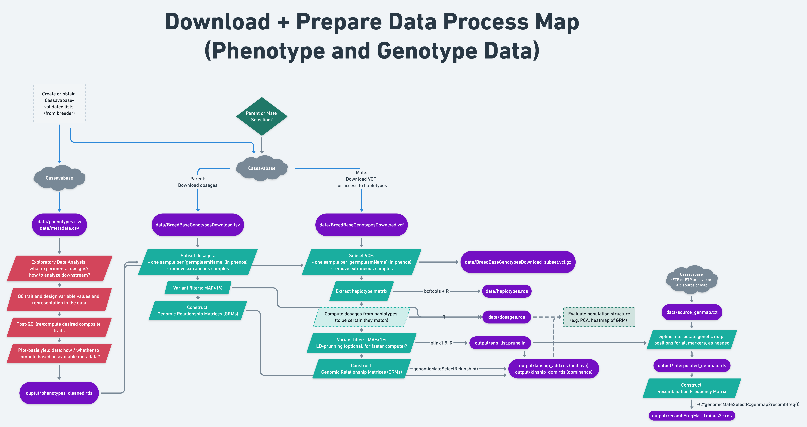
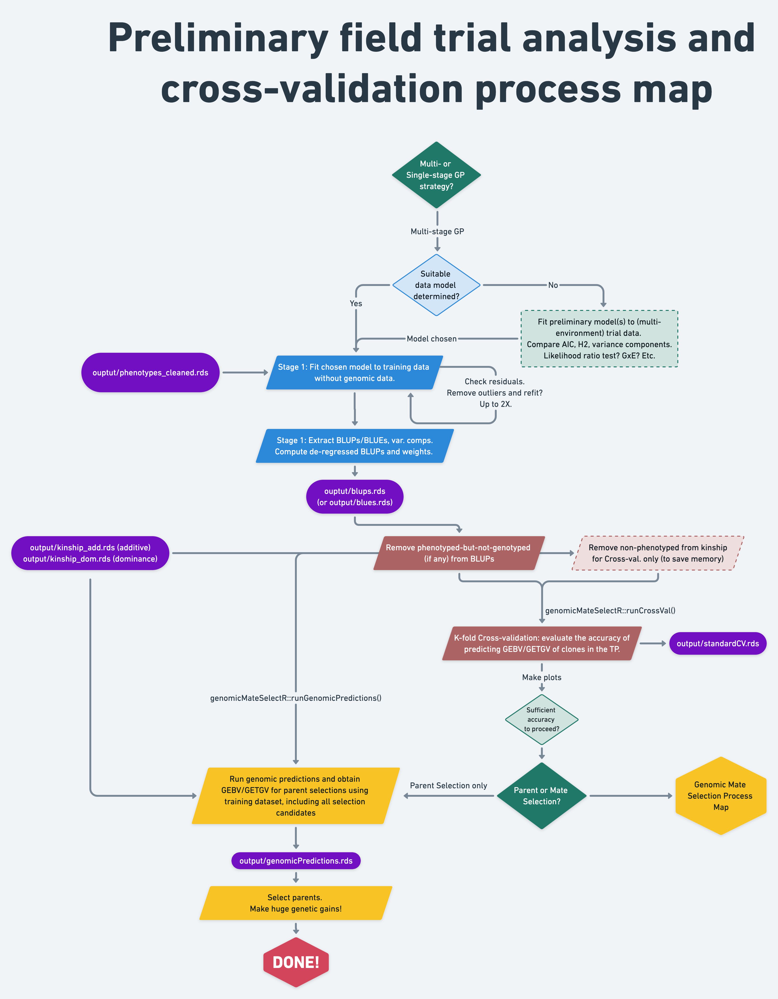

# Using this manual

## Suggested workflow

-   Create a `workflowR` repository for your genomic prediction analysis, following [instructions here](#create_project).

-   Follow along the following documents as templates and examples:

    -   **Genomic Selection Manual (THIS BOOK)**

    -   **GS Process Maps** (see [process map section below](process_maps), also placed strategically throughout the manual). There are four total:

        1.  Overview Process Map

        2.  Data Download and Preparation Process Map

        3.  Preliminary Analysis and Cross-validation Process Map

        4.  Genomic Mate Selection Process Map

    -   **GS Checklist (\~TO BE LINKED HERE\~)**

-   Use some variant of these documents and code examples to complete a genomic prediction analysis and develop a report on the results.

-   **Advice and best practices:**

    -   Choose your own data, traits, from cassavabase

    -   Work through what the example code actually does for yourself.

        -   Follow-up functions you don't know by going to the manual.
        -   I will strive to provide references to other tutorials, papers, etc. to give context and help you learn more detail where desired..

    -   Inevitably, we will want divergences, alterations, bells-and-whistles on top of the process documented. **SUGGEST** altering and developing your own **process maps** and **checklists** as you go.

    -   Use a combination of Rmarkdown (**.Rmd**) and Rscripts (**.R**) to document your analysis, as demonstrated.

    -   Take the time to write commentary throughout. In full sentences, what do you intend to do? How do you interpret the results? What is the next step? Etc.

    -   Take the time to think through the naming of datasets, files, folders, R objects, etc.

    -   Use Git version control, made easy with Rstudio.

    -   Publish your code to GitHub and a report on your results as a webpage using GitHub Pages. I will demonstrate using the package `workflowR` to manage these aspects.

## Prerequisites

1.  You need to install R, Rstudio and relevant R packages *in advance*. Instructions are in the next section.
2.  You need to know at least some R syntax. Links to learning resources are also provided in a section below. If you've never used R before, you are going to have trouble following the coding aspects in this manual.

## Install software and packages

### R, Rstudio, R packages

-   Install R and Rstudio

    -   [How to Install R on Windows, Mac OS X, and Ubuntu Tutorial](https://www.datacamp.com/community/tutorials/installing-R-windows-mac-ubuntu)

    -   [Installing R and RStudio](https://rstudio-education.github.io/hopr/starting.html)

-   [Rstudio](https://www.rstudio.com/)

-   Install packages

    -   `tidyverse` (includes `dplyr`, `tidyr`, `ggplot2`, `magrittr` and other really useful ones)
    -   `genomicMateSelectR`
    -   `workflowr`

```{r, eval=F}
install.packages(c("tidyverse","workflowr", "sommer", "lme4"))
```

```{r, eval=F}
devtools::install_github("wolfemd/genomicMateSelectR", ref = 'master') 
```

### Command-line Programs

Using Cassavabase-derived data mostly, but not entirely removes the need for command-line informatics tools. However, I was not able to totally avoid it in the example. Furthermore, this will be a valuable skill / experience to learn.

For the section on ["preparing genotype data"](prepare-genotypic-data) and further downstream when we do some steps to [check the validity of the pedigree](verify-pedigree-relationships) we end up needing some bioinformatics tools.

#### Windows

The three possible Linux-emulator applications that colleagues have recommended to me for Windows users:

1\. Windows Subsystem for Linux: <https://docs.microsoft.com/en-us/windows/wsl/install>

2\. Git BASH for Windows: <https://gitforwindows.org/>

3\. Cygwin: <https://www.cygwin.com/>

I can't give you much advice beyond those links. **Get googling for solutions!**

I found this open-access google doc: <http://bit.ly/2FSSjH6> which *might* provide guidance for Windows users.

**BACK-UP PLAN:** We might explore setting up a Cornell-based BioHPC node and allowing everyone to log-in to it remotely. The BioHPC has all the programs we could possibly want and gives access to more memory/compute cores than any single laptop.

#### Mac

You'll already have access to most of the commands I'll demonstrate, e.g. `grep`, `cut`. I recommend installing "[Homebrew](https://brew.sh/)" which will enable you to easily install e.g. `vcftools` and `bcftools` by doing e.g. `brew install vcftools` in the terminal.

#### Programs we might use

-   Bioinformatics command-line software tools:

    -   [`vcftools`](https://vcftools.github.io/man_latest.html)

    -   [`bcftools`](https://samtools.github.io/bcftools/bcftools.html)

    -   [`plink1.9`](https://www.cog-genomics.org/plink/): When it comes up late in the pipeline, I actually describe the process of getting it working on a (my) Mac laptop. In a pinch, you can download and unzip the pre-complied plink program on your machine and then use `./plink` to run the program.

-   There are some other commands we might encounter, that should come pre-available, at least in the Mac and Linux command lines.

## Learning R and more

-   **R for Data Science (<https://r4ds.had.co.nz/>)**:\
    As the Rstudio / Tidyverse team recommends here (<https://www.tidyverse.org/learn/>), this book is "the best place to start learning the tidyverse". Just about anyone should be able to (1) read the brief introduction and (2) look over the table of contents and quickly find a starting point that meets their level / interest.

-   **Data Challenge Lab (<https://datalab.stanford.edu/challenge-lab>)\
    **Where students develop their data skills by solving a progression of increasingly difficult challenges. I just discovered this. There is much here that I think is useful. Especially amongst the "Open Content" (<https://dcl-docs.stanford.edu/home/>). For example:

    -   **Data Wrangling**\
        <https://dcl-wrangle.stanford.edu/manip-basics.html>

    -   **Functional Programming\
        **[https://dcl-prog.stanford.edu/\
        ](https://dcl-prog.stanford.edu/)<https://dcl-prog.stanford.edu/purrr-mutate.html> (I've been told my loops using purrr package functions are confusing... check this out).\
        Also:<https://dcl-prog.stanford.edu/purrr-parallel.html>

-   **Learn the tidyverse\
    **[https://www.tidyverse.org/learn/\
    ](https://www.tidyverse.org/learn/)<https://www.tidyverse.org/packages/>

-   **APS 135: Introduction to Exploratory Data Analysis with R\
    **(<https://dzchilds.github.io/eda-for-bio/>)\
    Has some useful intro sections on the very basics of R and Rstudio, seems to have come out of a Plant Science department, so there is that.

-   **Stat545: Data wrangling, exploration, and analysis with R**\
    <https://stat545.com/>

[**Compendium of Learning Resources gDoc**](https://docs.google.com/document/d/1FbT_n66WvHPL9E3hwNQJenntoS-TPgkIR-7xTBW8rBk/edit?usp=sharing): This google doc contains all the links/references above. It contains even more, and I hope to maintain it as a growing, dynamic, more comprehensive annotated list of resources for learning R, Rstudio, data science and more.

### Rmarkdown and `workflowR`

-   [Rmarkdown Vignette and Cheatsheet](https://cran.r-project.org/web/packages/rmarkdown/vignettes/rmarkdown.html)
-   [`workflowr`: organized + reproducible + shareable data science in R](https://workflowr.github.io/workflowr/)

### Piping code `%>%`

-   [YouTube Video Intro](https://www.youtube.com/watch?v=KO35_7arizY&ab_channel=RsquaredAcademy)
-   [magrittr package page](https://magrittr.tidyverse.org/)

### Hotkeys

Pretty critical to learn a few of these, especially these:

-   `CMD+Option+I` = create chunk
-   `Shift+CMD+M` = `%>%` pipe operator
-   `CMD+Enter` = submit (run) lines of code in your Rmd or R script to the console.

## R sessions, packages to load

I will use the `tidyverse` and also `genomicMateSelectR` packages throughout the pipeline.

There are others that may appear.

I recommend, for each pipeline segment, starting with a new R session. Begin each segment, with a step to load these R packages:

```{r, message=F}
library(tidyverse)
library(genomicMateSelectR)
library(gt) # just for the nice looking tables
```

## High performance and remote computing

The example in this manual is designed to work on a laptop... at least a new one. I've got 16-cores and 64GB RAM on the machine I developed it on.

In practice, with the large number of plots, clones and SNPs that we *actually* work with, we will not use a laptop for these computations.

At some point, perhaps at the end of the pipeline run-through we will want to cover the (remote) use of high performance computing machines to facilitate.

# Process maps

## Overview Process Map

{width="100%"}

## Data Download and Preparation Process Map

{width="100%"}

## Preliminary Analysis and Cross-validation Process Map

{width="100%"}

## Genomic Mate Selection Process Map

{width="100%"}
