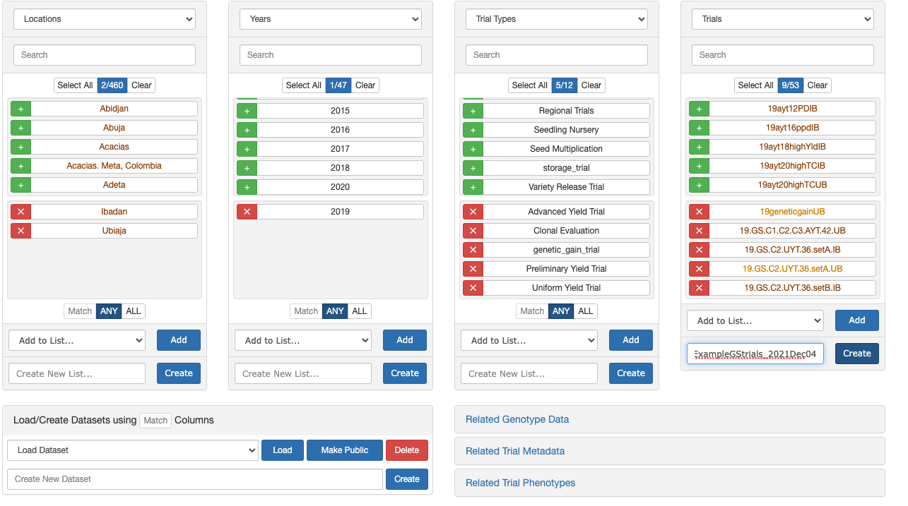
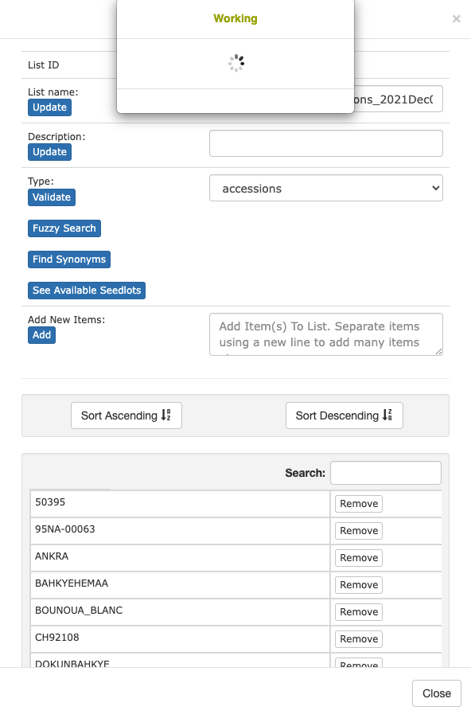
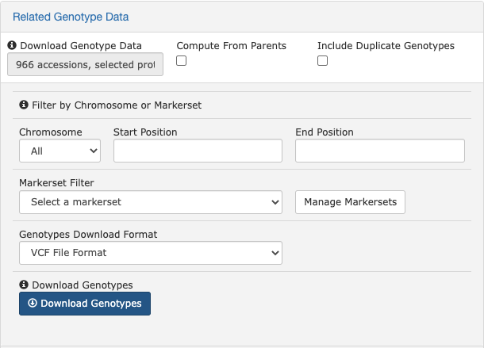

# Download training data

Go to [Cassavabase](https://www.cassavabase.org/) or your favorite alternative BreedBase.

Login.

Go to the **Search \> Wizard**

{width="300"}

## Example dataset

For the sake of example, I will choose a small, but real dataset that I think will exemplify how data should be stored on the DB. Further, I choose data that have key features, including pedigree relationship and a high-proportion of genotyped accessions.

### Create trial list

Create a list of trials using the "Wizard"

IITA trials at Ibadan and Ubiaja locations, planted in 2019. Further chose key trial types and specific trials as seen in screenshot.

Create list: **IITA_ExampleGStrials_2021Dec04**

### Download related trial data

Clear Wizard panes

Start from the new list of trials created: **"IITA_ExampleGStrials_2021Dec04"**

Download **"Related Trial Metadata"** and **"Related Trial Phenotypes"**

Exports .csv files `phenotype.csv` and `metadata.csv`.

Store in `data/` sub-directory for current project.

### Make an accession list

**\[NEW + EXPTL\]** Choose:\
**Genotyping Protocol:** "IITA DArT-GBS 08 Aug 2021", *then*\
**Accessions:** "Select All"\

Create list **"IITA_ExampleGSaccessions_2021Dec05"**.

### Validate lists

At this stage, validate the lists that were created to avoid problems in downloading. This is a critical step and an opportunity also to correct things in the database.

Click "Lists" in the top navigation bar.

Find the accession list we created.

Click the list name "**IITA_ExampleGSaccessions_2021Dec05**" in my case.

Click the **"Validate"** button. There will be a waiting period.

{width="270"}

If the list fails, there will be some guidance provided as to the problem. Correct it if possible. Seek assistance with the database administrator or others if necessary.

{width="368"}

In my example, the list *did* fail validation.

I do not 100% know the consequences of the following two choices, but I will:

-   Choose "Replace synonyms with corresponding DB name" under "List elements matching a synonym".

    -   **This button didn't seem to do anything permanent.**

-   So I decided to manually delete three accessions: **"Kaleso"** and "**W940102**" and lastly **"ANKRA"**.

-   After doing this, recheck that the list passes validation and close the pop-up once it has.

***Emphasis on this being an aspect requiring attention by and collaboration with data generators / managers!!!***

### Download related trial genotype data

Download **"Related Trial Genotype Data",** choosing both available formats: VCF and Dosage Matrix (.tsv).\
{width="485"}\
**NOTE:** This probably will take a while and usually times out. However, Cassavabase will complete preparation of the file even if you disconnect and have it ready-to-go when you return, when ready, it should begin downloading immediately.

**NOTE ALSO that these downloads are in the range of 700Mb (VCF) and 150Mb (Dosage TSV).**

### Download Pedigree

Go to "Manage \> [Download](https://www.cassavabase.org/breeders/download) \> Download Pedigree"

{width="226"}

