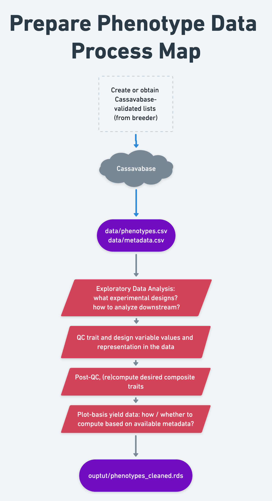

# Prepare phenotype data

```{r setup, include=F, echo=F}
library(tidyverse); library(genomicMateSelectR)
```

-   **Context and Purpose:** In this step, we do quality control, clean and format training data for further analysis.
-   **Upstream:** Section \@ref(download-training-data) - training data download
-   **Downstream:** pretty much everything
-   **Inputs:** "Raw" field trial data
-   **Expected outputs:** "Cleaned" field trial data

## Process Map

{width=100%}

## Read DB data

Load the phenotype and metadata downloads into R.

I built a function `readDBdata` that simply wraps around `read.csv`, reads and merges the metadata to the plot-basis data. The `metadataFile=` argument can be left NULL.

```{r}
dbdata<-readDBdata(phenotypeFile = here::here("data","phenotype.csv"),
                   metadataFile = here::here("data","metadata.csv"))
```

**HINT:** At any point in the manual, if I reference or use a custom function in the `genomicMateSelectR`, I encourage you to check out the reference page for that function, e.g. [`readDBdata()`](https://wolfemd.github.io/genomicMateSelectR/reference/readDBdata.html). Or look at the code yourself by typing e.g. `readDBdata` at the R console or heading to the GitHub repo.

## Check experimental designs {#detect_designs}

**Checklist:** Are the data plot-basis, plant-basis or a mixture? If plant-basis data are present, should they be converted to plot-basis for further analysis?

```{r}
dbdata %>% count(observationLevel)
# table(dbdata$observationLevel)
```

Only plot-basis in this case.

**Checklist:** What experimental designs are present? How are they represented by the variables in the dataset? Are all designs consistent with your expectations, for example relative to the reported "`trialType`", "`studyName`" and/or "`studyDesign`"?

In this step, in the past, I have not been certain of the experimental designs of the trials I had downloaded. I was also not certain how the designs were represented in the column-names. For this reason, I developed an *ad hoc* custom code to "detect" the designs. I built the `genomicMateSelectR` function `detectExptDesigns()`. See an example [here](https://wolfemd.github.io/IITA_2021GS/01-cleanTPdata.html#Detect_experimental_designs).

**RECOMMENDATION:** Each analyst needs to use exploratory data anlaysis, making summary statistics and plots as necessary to determine how the data should be modelled downstream. If there are missing or incorrectly represented trial design variables, ***get it corrected on the database (contact breeding program data manager, as necessary)***.

Because I have a small example dataset, it is possible to look at 9 trials and evaluate.

Often, *many* more trials are part of a genomic prediction. This is why it is essential that trial designs be consistent, and clear to the analyst. You may need to derive a strategy similar to the `detectExptDesigns()` function to semi-automate the process.

```{r}
library(gt)
dbdata %>% 
     count(studyName,trialType, studyDesign, numberBlocks,numberReps,entryType) %>% 
     spread(entryType,n) %>% 
     gt()  %>% 
     tab_options(table.font.size = pct(75))
```

Summary table above shows:

1)  **trialType** and **studyDesign** cannot be 100% relied upon, at least not here.
2)  The only trial actually listed as having `studyDesign=="Augmented"` does not have "check" vs. "test" distinguished in the "entryType".
3)  A `trialType=="Clonal Evaluation"` with `studyDesign=="RCBD"` but actually only 1 replication.

Next, I'll check if the **replicate** and **blockNumber** columns reliably distinguish complete and incomplete blocks in the data.

```{r}
dbdata %>% 
     group_by(studyName) %>% 
     summarize(N_replicate=length(unique(replicate)),
               N_blockNumber=length(unique(blockNumber))) %>% 
     gt() %>% tab_options(table.font.size = pct(75))
```

Here, I notice that except 1 trial (**19.GS.C1.C2.C3.AYT.42.UB**) has the same number of reps and blocks.

The question is, are complete replications of the experiment indicated by **replicate** and incomplete sub-blocks represented by **blockNumber**

```{r}
dbdata %>% 
     group_by(studyName) %>% 
     summarize(N_replicate=length(unique(replicate)),
               N_blockNumber=length(unique(blockNumber)),
               doRepsEqualBlocks=all(replicate==blockNumber)) %>% 
     gt() %>% tab_options(table.font.size = pct(75))
```

So for 1 trial, there are 3 complete blocks, no sub-blocks. For 6 trials, there are 2 complete replications and nested sub-blocks represented by the **blockNumber** variable. For 2 trials, there are only incomplete blocks.

Next, I decided to check that the **replicate** column definitely means complete blocks. The below might look a bit complicated, but I basically merge two summaries: (1) he overall number of accessions per trial, and (2) the average number of accessions per replicate per trial.

```{r}
# the overall number of accessions per trial
dbdata %>% 
     group_by(studyName) %>% 
     summarize(N_accession=length(unique(germplasmName))) %>% 
     # the average number of accessions per replicate per trial
     left_join(dbdata %>% 
                    group_by(studyName,replicate) %>% 
                    summarize(N_accession=length(unique(germplasmName))) %>% 
                    group_by(studyName) %>% 
                    summarize(avgAccessionsPerReplicate=ceiling(mean(N_accession)))) %>% 
     gt() %>% tab_options(table.font.size = pct(75))
```

The numbers are very similar for all trials, indicating complete blocks.

One more: look at the min, mean and max number of accessions per **blockNumber**.

```{r}
# the overall number of accessions per trial
dbdata %>% 
     group_by(studyName) %>% 
     summarize(N_accession=length(unique(germplasmName))) %>% 
     left_join(dbdata %>% 
     group_by(studyName,replicate,blockNumber) %>% 
     summarize(N_accession=length(unique(germplasmName))) %>% ungroup() %>% 
     group_by(studyName) %>% 
     summarize(minAccessionsPerBlock=ceiling(min(N_accession)),
               avgAccessionsPerBlock=ceiling(mean(N_accession)),
               maxAccessionsPerBlock=ceiling(max(N_accession)))) %>% 
     gt() %>% tab_options(table.font.size = pct(60))
```

From this, you can see that except for `studyName=="19.GS.C1.C2.C3.AYT.42.UB"` the sub-blocks represented by **blockNumber** have only subsets of the total number of accessions in the trial, as expected.

Further, except for `studyName=="19geneticgainUB"` all trials have pretty consistently sized sub-blocks.

Now I will *ad hoc* create two variables (**CompleteBlocks** and **IncompleteBlocks**), indicating (`TRUE/FALSE`) whether to model using the **replicate** and/or **blockNumber** variable.

I *also* like to create *explicitly nested* design variables (**yearInLoc**, **trialInLocYr**, **repInTrial**, **blockInRep**).

```{r}
dbdata %<>% 
     group_by(studyName) %>% 
     summarize(N_replicate=length(unique(replicate)),
               N_blockNumber=length(unique(blockNumber)),
               doRepsEqualBlocks=all(replicate==blockNumber)) %>% 
     ungroup() %>% 
     mutate(CompleteBlocks=ifelse(N_replicate>1,TRUE,FALSE),
            IncompleteBlocks=ifelse(N_blockNumber>1 & !doRepsEqualBlocks,TRUE,FALSE)) %>% 
     left_join(dbdata) %>% 
     mutate(yearInLoc=paste0(programName,"_",locationName,"_",studyYear),
            trialInLocYr=paste0(yearInLoc,"_",studyName),
            repInTrial=paste0(trialInLocYr,"_",replicate),
            blockInRep=paste0(repInTrial,"_",blockNumber))
```

Just to check:

```{r}
dbdata %>% 
     count(studyName,CompleteBlocks,IncompleteBlocks) %>% 
     left_join(dbdata %>% 
                    group_by(studyName) %>% 
                    summarize(nRepInTrial=length(unique(repInTrial)),
                              nBlockInRep=length(unique(blockInRep)))) %>% 
     gt() %>% tab_options(table.font.size = pct(67))
```

## Traits and Trait Abbreviations

Cassavabase downloads use very long column-names corresponding to the [full trait-ontology name](https://cropontology.org/ontology/CO_334). For convenience, I replace these names with abbreviations, documented here. For eventual upload of analysis results, names will need to be restored to ontology terms.

I also use this opportunity to subselect traits.

```{r}
traitabbrevs<-tribble(~TraitAbbrev,~TraitName,
        "CMD1S","cassava.mosaic.disease.severity.1.month.evaluation.CO_334.0000191",
        "CMD3S","cassava.mosaic.disease.severity.3.month.evaluation.CO_334.0000192",
        "CMD6S","cassava.mosaic.disease.severity.6.month.evaluation.CO_334.0000194",
        "DM","dry.matter.content.percentage.CO_334.0000092",
        "RTWT","fresh.storage.root.weight.per.plot.CO_334.0000012",
        "NOHAV","plant.stands.harvested.counting.CO_334.0000010")
traitabbrevs %>% gt()#rmarkdown::paged_table()
```

Run function `renameAndSelectCols()` to rename columns and remove unselected traits.

```{r}
dbdata<-renameAndSelectCols(traitabbrevs,
                            indata=dbdata,
                            customColsToKeep = c("observationUnitName",
                                                 "CompleteBlocks",
                                                 "IncompleteBlocks",
                                                 "yearInLoc",
                                                 "trialInLocYr",
                                                 "repInTrial","blockInRep"))
```

## QC Trait Values

At this point in the pipeline, we should check the all trait values are in allowable ranges. Different ways to approach this. Feel free to make some plots of your data!

The database also has mechanisms to ensure trait values are only within allowable ranges.

Nevertheless, as a habit, I have an simple *ad hoc* approach to this:

```{r}
# comment out the traits not present in this dataset
dbdata<-dbdata %>% 
     dplyr::mutate(CMD1S=ifelse(CMD1S<1 | CMD1S>5,NA,CMD1S),
                   CMD3S=ifelse(CMD3S<1 | CMD3S>5,NA,CMD3S),
                   # CMD6S=ifelse(CMD6S<1 | CMD6S>5,NA,CMD6S), 
                   # CMD9S=ifelse(CMD9S<1 | CMD9S>5,NA,CMD9S),
                   # CGM=ifelse(CGM<1 | CGM>5,NA,CGM),
                   # CGMS1=ifelse(CGMS1<1 | CGMS1>5,NA,CGMS1),
                   # CGMS2=ifelse(CGMS2<1 | CGMS2>5,NA,CGMS2),
                   DM=ifelse(DM>100 | DM<=0,NA,DM),
                   RTWT=ifelse(RTWT==0 | NOHAV==0 | is.na(NOHAV),NA,RTWT),
                   # SHTWT=ifelse(SHTWT==0 | NOHAV==0 | is.na(NOHAV),NA,SHTWT),
                   # RTNO=ifelse(RTNO==0 | NOHAV==0 | is.na(NOHAV),NA,RTNO),
                   NOHAV=ifelse(NOHAV==0,NA,NOHAV),
                   NOHAV=ifelse(NOHAV>42,NA,NOHAV)
                   # RTNO=ifelse(!RTNO %in% 1:10000,NA,RTNO)
     )
```

## Post-QC: composite traits

Now that component traits are QC'd, it's time to compute any composite traits.

By composite traits, I mean traits computed from combinations of other traits.

Examples for cassava: season-wide mean disease severity, harvest index, and fresh root yield.

### Season-wide mean disease severity

```{r}
# [NEW AS OF APRIL 2021]
## VERSION with vs. without CBSD
## Impervious to particular timepoints between 1, 3, 6 and 9 scores

# Without CBSD (West Africa)
dbdata<-dbdata %>% 
  mutate(MCMDS=rowMeans(.[,colnames(.) %in% c("CMD1S","CMD3S","CMD6S","CMD9S")], na.rm = T)) %>% 
  select(-any_of(c("CMD1S","CMD3S","CMD6S","CMD9S")))

# With CBSD (East Africa)
# dbdata<-dbdata %>% 
#   mutate(MCMDS=rowMeans(.[,colnames(.) %in% c("CMD1S","CMD3S","CMD6S","CMD9S")], na.rm = T),
#          MCBSDS=rowMeans(.[,colnames(.) %in% c("CBSD1S","CBSD3S","CBSD6S","CBSD9S")], na.rm = T)) %>% 
#   select(-any_of(c("CMD1S","CMD3S","CMD6S","CMD9S","CBSD1S","CBSD3S","CBSD6S","CBSD9S")))
```

### Fresh root yield (FYLD)

**RTWT** (fresh root weight per plot in kg) --> **FYLD** (fresh root yield in tons per hectare)

$$FYLD = \frac{RTWT_{kg / plot}}{MaxHarvestedPlantsPerPlot \times PlantSpacing}\times10$$ **NOTE:** *MaxHarvestedPlantsPerPlot* in formula above is to distinguish from the *plantsPerPlot* meta-data field, in case that a net-plot harvest is used. In other words, the value should be the total number of plants intended for harvest in a plot, assuming there were no missing plants in the plot.

*PlantSpacing* is the area in $m^2$ per plant.

```{r}
dbdata %>% 
     count(studyYear,studyName,studyDesign,plotWidth,plotLength,plantsPerPlot) %>% 
     mutate(plotArea=plotWidth*plotLength) %>% 
     gt() %>% tab_options(table.font.size = pct(67))
```

In the example trial data, the **`plantsPerPlot`** meta-data field is empty. To my knowledge, no meta-data field is available in BreedBase to represent a net-plot harvest.

***RECOMMEND INPUTING plantsPerPlot meta-data to cassavabase for your*** **breeding program!**

Luckily, since there are only 9 trials and this is a tutorial, we will decisions manually.

Firstly noting that the trial **19geneticgainUB** actually *does not* have phenotypes (for any trait). It will be excluded downstream. (~~*I might find a substitute genetic gain trial, from an earlier year, for the sake of this example*~~)

To decide what the real **MaxHarvestedPlantsPerPlot** and **plantsPerPlot** were likely to have been, I make two plots below and also compute the maximum NOHAV for each trial.

```{r}
dbdata %>% 
     ggplot(.,aes(x=NOHAV, fill=studyName)) + geom_density(alpha=0.75)
```

Maybe clearer to make a boxplot?

```{r}
dbdata %>% 
     # plot area in meters squared
     mutate(plotArea=plotWidth*plotLength) %>% 
     ggplot(.,aes(x=plotArea,y=NOHAV, fill=studyName)) + 
     geom_boxplot() + theme(axis.text.x = element_blank())
```

```{r}
plantsPerPlot_choices<-dbdata %>% 
     distinct(studyYear,studyName,plotWidth,plotLength,plantsPerPlot) %>% 
     left_join(dbdata %>% 
                    group_by(studyName) %>% 
                    summarize(MaxNOHAV=max(NOHAV, na.rm=T))) %>% 
          # plot area in meters squared
     mutate(plotArea=plotWidth*plotLength,
            # Number of plants per plot
            plantsPerPlot=MaxNOHAV,
            plantsPerPlot=ifelse(studyName=="19.GS.C2.UYT.36.setA.UB",20,plantsPerPlot)) %>% 
     # exclude the empty genetic gain trial
     filter(studyName!="19geneticgainUB") %>% 
     select(studyName,plotArea,MaxNOHAV,plantsPerPlot)
plantsPerPlot_choices %>% gt() #%>% tab_options(table.font.size = pct(67))
```

For the sake of this example, it is 'ok' to make choices on the basis I have just done.

***As a data generator, in-house at each breeding program, no reason not to get the correct answer and repair the metadata on the database!***

```{r}
dbdata %<>%
     # remove the empty genetic gain trial
     filter(studyName!="19geneticgainUB") %>% 
     select(-plantsPerPlot) %>% 
     # join plantsPerPlot_choices to the trial data
     left_join(plantsPerPlot_choices) %>% 
     # compute fresh root yield (FYLD) in tons per hectare
     mutate(PlantSpacing=plotArea/plantsPerPlot,
            FYLD=RTWT/(plantsPerPlot*PlantSpacing)*10)
dbdata %>% ggplot(.,aes(x=FYLD,fill=studyName)) + geom_density(alpha=0.75)
```

Additional things to compute:

1.  log-transform yield traits: this is a habit based on experience. Linear mixed-models should have normally distributed homoskedastic residuals, if they don't log-transform the response variable often helps. For FYLD and related traits, I always log-transform.

```{r}
# I log transform yield traits 
# to satisfy homoskedastic residuals assumption 
# of linear mixed models
dbdata %<>% 
     mutate(DYLD=FYLD*(DM/100),
            logFYLD=log(FYLD),
            logDYLD=log(DYLD),
            PropNOHAV=NOHAV/plantsPerPlot) 
# remove non transformed / per-plot (instead of per area) traits
dbdata %<>% select(-RTWT,-FYLD,-DYLD)
dbdata %>% ggplot(.,aes(x=logFYLD,fill=studyName)) + geom_density(alpha=0.75)
```

Debatable whether this is better. Let's not dwell on it. Onward!

**SUGGESTION:** For individuals working this manual, consider making different, or no transformations as you see fit, with your own data. Even better, set-up a direct comparison of results with- vs. without-transformation.\*

## Save "cleaned" phenotypes {#save_cleaned_phenos}

```{r}
saveRDS(dbdata,file=here::here("output","phenotypes_cleaned.rds"))
```
