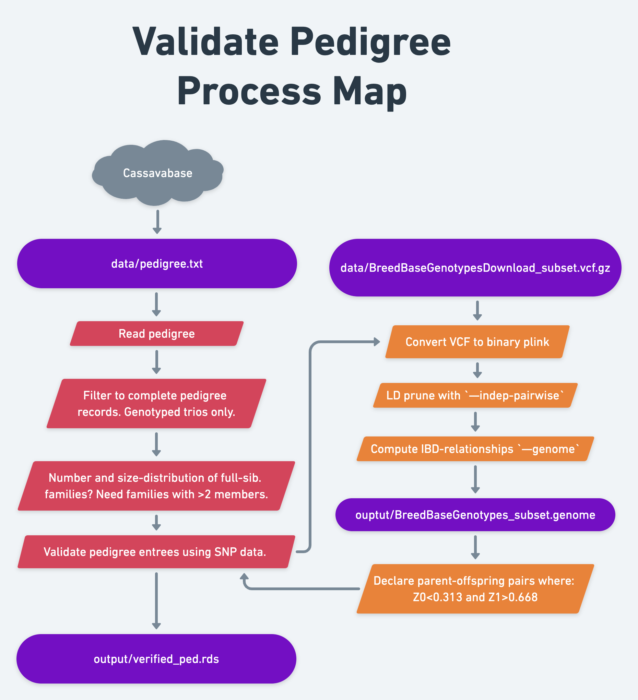
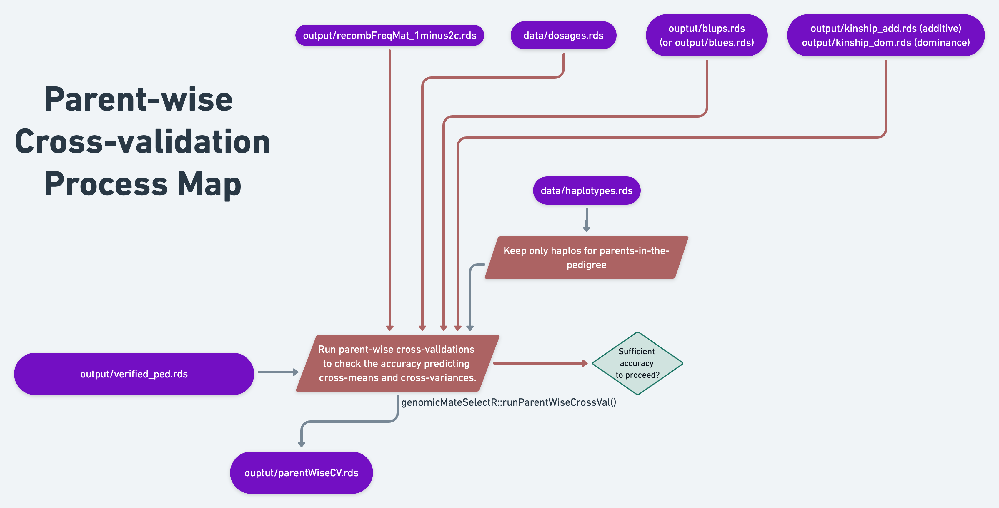

# Accuracy of cross prediction?

```{r setup, include=F, echo=F}
library(tidyverse); library(genomicMateSelectR); library(sommer); library(gt)
```

-   **Context and Purpose:**

-   **Upstream:** Section \@ref() -

-   **Downstream:**

-   **Inputs:**

-   **Expected outputs:**

Before proceeding, one note: the steps below may be hard for some breeding programs, especially when open-pollination is used, most families are small, both parents are not genotyped. If this is the case, or your attempt to implement the steps below fail, do not despair. The k-fold cross-validation accuracy should (hopefully) be related to the accuracy of predicting cross-variances. Therefore, these steps are not 100% necessary for implementing mate selection. Furthermore, mate selection can be done simply on the basis of predicted family-means, whose prediction accuracy should definitely be forecast based on the k-fold cross-validation accuracy. Predicting the usefulness of crosses (remember $\hat{UC} = \hat{\mu} + i \times \hat{\sigma}$) requires the prediction of cross-variance (the $\hat{\sigma}$ part), which requires accurate phasing information for non-inbred lines.

## Pedigree

We [downloaded a pedigree](download-pedigree) in the last section of the ["download training data"](download-training-data) chapter.

### Read pedigree

```{r}
# read.table() throws an error, some aspect of the formatting from the database download
## read.table(here::here("data","pedigree.txt"), 
##            stringsAsFactors = F, header = T)

# use read_delim instead
ped<-read_delim(here::here("data","pedigree.txt"),delim = "\t")
```

Filter: Keep only complete pedigree records.

```{r}
ped %<>% 
     dplyr::select(-Cross_Type) %>% 
     filter(!is.na(Female_Parent),
            !is.na(Male_Parent),
            Female_Parent!="?",
            Male_Parent!="?") %>% 
     distinct
```

Number of full-sib families?

```{r}
ped %>% distinct(Female_Parent,Male_Parent) %>% nrow()
```

462 in this set.

Summarize distribution of full-sib family sizes

```{r}
ped %>%   
  count(Female_Parent,Male_Parent) %>% arrange(desc(n))  %>%  summary(.$n)
```

Less than 1/3 families have more than 1 member. We need \>\>2 members for this analysis.

### Fully genotyped trios?

For the parent-wise cross-validation, we need pedigree entrees where not both of the 2 parents *and* the accession itself are in our genotyped dataset. We don't need them to necessarily be phenotyped though.

```{r}
dosages<-readRDS(here::here("data","dosages.rds"))
genotyped_gids<-rownames(dosages)
```

Are all of the entrees themselves genotyped?

```{r}
all(ped$Accession %in% genotyped_gids)
```

Yes. That was pretty much assured by the way we set-up the download originally.

```{r}
all(ped$Female_Parent %in% genotyped_gids)
```

There is no guarantee on the parents though...

```{r}
table(ped$Female_Parent %in% genotyped_gids)
```

```{r}
table(ped$Male_Parent %in% genotyped_gids)
```

Indeed, only portions of the parents are present in our SNP data.

```{r}
genotyped_ped<-ped %>% 
     filter(Accession %in% genotyped_gids,
            Female_Parent %in% genotyped_gids,
            Male_Parent %in% genotyped_gids)
genotyped_ped %>% nrow()
```

That leaves us with a very small set of complete trios (accession + male parent + female parent).

```{r}
genotyped_ped %>% 
     count(Female_Parent,Male_Parent) %>% arrange(desc(n))  %>%  summary(.$n)
```

Looks like 104 full-sib families.

How many families have \>1 offspring?

```{r}
genotyped_ped %>% 
     count(Female_Parent,Male_Parent) %>% 
     filter(n>1)
```

In the end, our small example dataset has only 18 families with \>1 offspring.

**Remember that:** (1) This is a small, example dataset, and (2) our goal is to estimate the accuracy of predicting the genetic-variance in a family.

**For reference sake:** In a previous analysis for IITA's large training population, I had \~6200 entries in the pedigree, 196 full-sib families with \>=10 members, and the average family size was \~5.

It is unlikely this is sufficient for a good estimate, it's possible this won't even work in the analysis, but we will try!

## Verify pedigree relationships

There is one additional step I highly recommend and will demonstrate here.

Plant breeding pedigrees can often have errors, esp. for the male (pollen) parent. For that reason, I recommend using the genomic data to check the pedigree. We do not want our estimate of family-genetic variance prediction accuracy further detrimated by the presence of incorrect pedigree entrees.

There are various software options to do this, probably an R package or two.

My approach uses the `--genome` IBD calculator in the command-line program [**PLINK v1.9**, click here](https://www.cog-genomics.org/plink/1.9/) for the PLINK1.9 manual and to download/install the program.

See an example implementation done in 2021 here: <https://wolfemd.github.io/IITA_2021GS/03-validatePedigree.html>

**PLINK1.9 pipeline to use:**

1.  Convert the VCF file to binary plink format

2.  **For a full dataset / "official anlaysis":**

    -   2a: Subset whole-pop. binary plink files to only lines in the pedigree.
    -   2b: LD-prune `--indep-pairwise 100 25 0.25` stringent, but somewhat arbitrary
    -   ***Skip this step in the example dataset:*** population is small and we already randomly sampled a small number of markers to make compute faster in the example meaning that LD is probably low.

3.  Compute IBD-relationships `--genome`

4.  Parent-offspring relationships determination (see below)

**Determine parent-offspring relationship status based on `plink` IBD:**

-   should have a kinship $\hat{\pi} \approx 0.5$.

-   Three standard IBD probabilities are defined for each pair; the probability of sharing zero (Z0), one (Z1) or two (Z2) alleles at a randomly chosen locus IBD.

-   The expectation for siblings in terms of these probabilities is Z0=0.25, Z1=0.5 and Z2=0.25.

-   The expectation for parent-offspring pairs is Z0=0, Z1=1 and Z2=0.

-   Based on work I did in *2016* (never published), declare a parent-offspring pair where: Z0\<0.313 and Z1>0.668.

### Process Map

{width=100%}

### Install plink1.9 (Mac)

Your results will vary. Here is how I got it installed on my mac laptop.

1.  Downloaded it to my `~/Downloads/` folder and unzipped (double-click the **.zip** file)
2.  At the terminal: `cd ~/Downloads/plink_mac_20220305`
3.  Move the binary file (`plink`) to my command-line path: `cp ~/Downloads/plink_mac_20220305/plink /usr/local/bin/`
4.  Now typing `plink` at the command line will always engage the program
5.  However, I had to convince MacOS that it was safe by following this instruction: <https://zaiste.net/os/macos/howtos/resolve-macos-cannot-be-opened-because-the-developer-cannot-be-verified-error/>

### Make binary plink from VCF

```{bash, eval=F}
# in the terminal change directory
# go to the data/ directory where the VCF file is located
plink --vcf BreedBaseGenotypes_subset.vcf.gz \
     --make-bed --const-fid --keep-allele-order \
     --out BreedBaseGenotypes_subset
```

### Run plink IBD

```{bash, eval=F}
plink --bfile BreedBaseGenotypes_subset \
  --genome \
  --out ../output/BreedBaseGenotypes_subset;
```

This creates an output file with extension `*.genome` in the `output` directory. For our 963 individual dataset, the file size is only 60M... beware, it could get huge if you have many samples.

See the plink1.9 manual here: <https://www.cog-genomics.org/plink/1.9/ibd> for details on what this does and what the output means.

### Verify parent-offspring relationships

```{r}
genome<-read.table(here::here("output/","BreedBaseGenotypes_subset.genome"),
                   stringsAsFactors = F,header = T) %>% 
     as_tibble
genome %>% head
```

```{r}
dim(genome)
```

```{r}
ped %>% 
     semi_join(genome %>% rename(Accession=IID1,Female_Parent=IID2)) %>% 
     left_join(genome %>% rename(Accession=IID1,Female_Parent=IID2))
```

```{r}
# Confirm Female_Parent - Offspring Relationship
## In the plink genome file
## IID1 or IID2 could be the Accession or the Female_Parent
conf_female_ped<-genotyped_ped %>% 
     inner_join(genome %>% 
                     rename(Accession=IID1,Female_Parent=IID2)) %>% 
     bind_rows(genotyped_ped %>% 
                    inner_join(genome %>% 
                                    rename(Accession=IID2,Female_Parent=IID1))) %>% 
     # Declare confirm-reject Accession-Female_Parent
     mutate(ConfirmFemaleParent=case_when(Z0<0.32 & Z1>0.67~"Confirm", 
                                          # Relatedness coeff differ if the Accession is the result of a self-cross
                                          Male_Parent==Female_Parent & PI_HAT>0.6 & Z0<0.3 & Z2>0.32~"Confirm",
                                          TRUE~"Reject")) %>% 
     dplyr::select(Accession,Female_Parent,ConfirmFemaleParent)
## Now do the same for the Accession-Male_Parent relationships
conf_male_ped<-genotyped_ped %>% 
     inner_join(genome %>% 
                     rename(Accession=IID1,Male_Parent=IID2)) %>% 
     bind_rows(genotyped_ped %>% 
                    inner_join(genome %>% 
                                    rename(Accession=IID2,Male_Parent=IID1))) %>% 
     # Declare confirm-reject Accession-Female_Parent
     mutate(ConfirmMaleParent=case_when(Z0<0.32 & Z1>0.67~"Confirm", 
                                          # Relatedness coeff differ if the Accession is the result of a self-cross
                                          Male_Parent==Female_Parent & PI_HAT>0.6 & Z0<0.3 & Z2>0.32~"Confirm",
                                          TRUE~"Reject")) %>% 
     dplyr::select(Accession,Male_Parent,ConfirmMaleParent)
# Now join the confirmed female and male relationships
# This regenerates the original "genotyped_ped" with two added columns
confirmed_ped<-conf_female_ped %>% 
     left_join(conf_male_ped) %>% 
     relocate(Male_Parent,.before = "ConfirmFemaleParent")
```

So, how well supported are the pedigree relationships according to my approach?

```{r}
confirmed_ped %>% 
     count(ConfirmFemaleParent,ConfirmMaleParent) %>% 
     mutate(Prop=round(n/sum(n),2))
```

-   78% of Accessions had both parents correct.
-   7% had the female but not the male correct.
-   4% had the male but not the female

### Subset to fully-validated trios

We can only run the cross-validation using a pedigree where the full trio (Accession's relationship to both parents) is validated.

Remove any without both parents confirmed.

```{r}
valid_ped<-confirmed_ped %>% 
     filter(ConfirmFemaleParent=="Confirm",
         ConfirmMaleParent=="Confirm") %>% 
     dplyr::select(-contains("Confirm"))
```

```{r}
valid_ped %>% nrow()
```

Leaves us with 105 validated entries in the pedigree

```{r}
valid_ped %>% 
     count(Female_Parent,Male_Parent) %>% 
     filter(n>1)
```

Luckily, 16 of the 18 full-sib families that have \>1 entry are still here.

```{r}
valid_ped %>% 
     count(Female_Parent,Male_Parent) %>% 
     filter(n>2)
```

Though only 5 families have more than 2...

### Write validated pedigree

```{r}
saveRDS(valid_ped,here::here("output","verified_ped.rds"))
```

## Parent-wise cross-validation

Refer to the following:

1.  [genomicMateSelectR::runParentWiseCrossVal() documentation](https://wolfemd.github.io/genomicMateSelectR/reference/runParentWiseCrossVal.html)
2.  Example of [IITA_2021GS Cross-validation](https://wolfemd.github.io/IITA_2021GS/05-CrossValidation.html#Parent-wise_cross-validation)

### Process Map

{width=100%}

### Load inputs and set-up

```{r, eval=F}
# Load verified ped
ped<-readRDS(here::here("output","verified_ped.rds")) %>% 
     # Rename things to match genomicMateSelectR::runParentWiseCrossVal()
     rename(GID=Accession,
            sireID=Male_Parent,
            damID=Female_Parent)
# Keep only families with _at least_ 2 offspring
ped %<>% 
     semi_join(ped %>% count(sireID,damID) %>% filter(n>1) %>% ungroup())

# GENOMIC RELATIONSHIP MATRIX
grms<-list(A=readRDS(file=here::here("output","kinship_add.rds")))

# BLUPs
blups<-readRDS(here::here("output","blups.rds")) %>% 
     # based on cross-validation, decided to exclude MCMDS from this analysis
     filter(Trait != "MCMDS") %>% 
     # need to rename the "blups" list to comply with the runCrossVal function
     rename(TrainingData=blups) %>% 
     dplyr::select(Trait,TrainingData) %>% 
     # need also to remove phenotyped-but-not-genotyped lines
     mutate(TrainingData=map(TrainingData,
                             ~filter(.,germplasmName %in% rownames(grms$A)) %>% 
                                  # rename the germplasmName column to GID
                                  rename(GID=germplasmName))) %>% 
     # It seems actually that runParentWiseCrossVal() wnats this column named "blups"
     rename(blups=TrainingData)

# DOSAGE MATRIX
## Dosages are also needed inside the runParentWiseCrossVal() function
## Reason is that they are used to extra SNP effects from GBLUP models
dosages<-readRDS(here::here("data","dosages.rds"))

# HAPLOTYPE MATRIX
## keep only haplos for parents-in-the-pedigree
## those which will be used in prediction, saves memory
haploMat<-readRDS(file=here::here("data","haplotypes.rds"))
parents<-union(ped$sireID,ped$damID) 
parenthaps<-sort(c(paste0(parents,"_HapA"),
                   paste0(parents,"_HapB")))
haploMat<-haploMat[parenthaps,]

# SELECTION INDEX
SIwts<-c(DM=15,
         logFYLD=20,
         logDYLD=20)
```

In the [genotype data processing stage](Prepare%20genotypic%20data), specifically in one of the last steps, we [created a recombination frequency matrix](recomb-freq-mat). To do this, we accessed a genetic map, interpolated it to the markers in our dataset and then used helper functions provided by `genomicMateSelectR`. We finally need that matrix.

```{r, eval=F}
# RECOMBINATION FREQUENCY MATRIX
recombFreqMat<-readRDS(file=here::here("output","recombFreqMat_1minus2c.rds"))
```

### Run cross-validation

```{r, eval=F}
starttime<-proc.time()[3]
parentWiseCV<-runParentWiseCrossVal(nrepeats=2,nfolds=5,seed=121212,
                                    modelType="A",
                                    ncores=10,
                                    ped=ped,
                                    blups=blups,
                                    dosages=dosages,
                                    haploMat=haploMat,
                                    grms=grms,
                                    recombFreqMat = recombFreqMat,
                                    selInd = TRUE, SIwts = SIwts)
elapsed<-proc.time()[3]-starttime; elapsed/60
```

Took about 3.5 minutes using 10 cores on my 16 core - 64 GB RAM machine. Memory usagage wasn't bad.

### Save results

```{r, eval=F}
saveRDS(parentWiseCV,file = here::here("output","parentWiseCV.rds"))
```

### Plot results

```{r}
parentWiseCV<-readRDS(here::here("output","parentWiseCV.rds"))
```

You will find the output of `runParentWiseCrossVal` is a list with two elements: "meanPredAccuracy" and "varPredAccuracy"

Take a peak at both to see how it's formatted:

```{r}
parentWiseCV$meanPredAccuracy %>% head
```

```{r}
parentWiseCV$varPredAccuracy %>% head
```

```{r}
parentWiseCV$meanPredAccuracy %>% 
     ggplot(.,aes(x=Trait,y=AccuracyEst,fill=Trait)) + geom_boxplot() + 
     labs(title="Accuracy Predicting Family Means")
```

Obviously not a good result, must have to do with the tiny dataset both for training prediction models (to get marker effects) and in terms of the small number of family-members in the small number of families available.

```{r}
parentWiseCV$varPredAccuracy %>% 
     # this will format the two column information 
     # indicating variances and covariances
     # into a single variable for the plot
     mutate(VarParam=paste0(Trait1,"\n",Trait2)) %>% 
     ggplot(.,aes(x=VarParam,y=AccuracyEst,fill=VarParam)) + geom_boxplot()
```

Surprising the variance accuracy actually appears *much* better than the mean accuracy... should definitely take this with equal skepticism to the result for the mean, for the same reasons!
