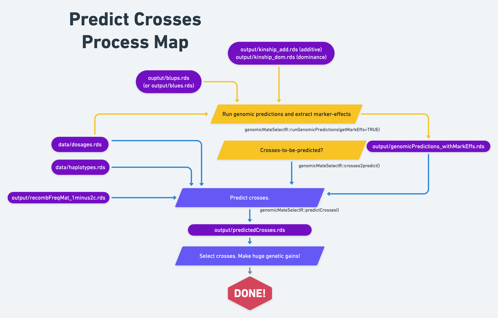

# Predict crosses

```{r setup, include=F, echo=F}
library(tidyverse); library(genomicMateSelectR); library(sommer); library(gt)
```

-   **Context and Purpose:**

-   **Upstream:** Section \@ref() -

-   **Downstream:**

-   **Inputs:**

-   **Expected outputs:**

We are finally (almost) ready to predict the performance of potential crosses. We have a few inputs to set-up.

## Process Map

{width=100%}

## Load inputs and set-up

Much the same as in the section on [parent-wise cross-validation](parent-wise-cross-validation).

```{r, eval=F}
# GENOMIC RELATIONSHIP MATRIX
grms<-list(A=readRDS(file=here::here("output","kinship_add.rds")))

# BLUPs
blups<-readRDS(here::here("output","blups.rds")) %>% 
     # based on cross-validation, decided to exclude MCMDS from this analysis
     filter(Trait != "MCMDS") %>% 
     # need to rename the "blups" list to comply with the runCrossVal function
     rename(TrainingData=blups) %>% 
     dplyr::select(Trait,TrainingData) %>% 
     # need also to remove phenotyped-but-not-genotyped lines
     mutate(TrainingData=map(TrainingData,
                             ~filter(.,germplasmName %in% rownames(grms$A)) %>% 
                                  # rename the germplasmName column to GID
                                  rename(GID=germplasmName)))

# DOSAGE MATRIX
## Dosages are also needed for runGenomicPredictions() when getMarkEffs=TRUE
## Reason is that they are used to extra SNP effects from GBLUP models
dosages<-readRDS(here::here("data","dosages.rds"))

# SELECTION INDEX
SIwts<-c(DM=15,
         logFYLD=20,
         logDYLD=20)
```

## Get marker effects

First, in the [chapter where we predicted GEBV](predict-parental-breeding-values), we used the `runGenomicPredictions()` function, which implements a **GBLUP** model, to predict **GEBV**.

We need to re-run `runGenomicPredictions()`, this time using the `getMarkEffs=TRUE` option, this will "backsolve" the RR-BLUP marker effect solutions from the GBLUP solutions, using the `backsolveSNPeff()` function under-the-hood.

Refer to the [`runGenomicPredictions()` documentation here](https://wolfemd.github.io/genomicMateSelectR/reference/runGenomicPredictions.html) and [this section of the vignette](https://wolfemd.github.io/genomicMateSelectR/articles/non_additive_models.html#returning-marker-effects-with-getmarkeffs-true) for more details.

The output SNP-effects will be formatted ready to be input into the `predictCrosses()` function.

```{r, eval=F}
gpreds_withMarkEffs<-runGenomicPredictions(modelType = "A", 
                                           selInd = T, SIwts = SIwts,
                                           getMarkEffs = TRUE,
                                           dosages = dosages,
                                           blups = blups, 
                                           grms = grms,
                                           ncores=3)
```

Save the results

```{r, eval=F}
saveRDS(gpreds_withMarkEffs,file = here::here("output","genomicPredictions_withMarkEffs.rds"))
```

```{r}
gpreds_withMarkEffs<-readRDS(here::here("output","genomicPredictions_withMarkEffs.rds"))
```

Notice that there is now a additional list-type column with the label **"allelesubsnpeff"** indicating that, because we ran an additive-only model, these SNP-effects represent predictions of allele substitution effects.

```{r}
gpreds_withMarkEffs$genomicPredOut[[1]]
```

Just to show, they are a single column matrix with rownames labelling each marker.

```{r}
gpreds_withMarkEffs$genomicPredOut[[1]]$allelesubsnpeff[[1]][1:5,]
```

## Crosses-to-predict

The `predictCrosses()` function will also need a **data.frame** indicating what pairs of parents we want to predict crosses for.

As a convenience, we can use the `crosses2predict()` function to make such a **data.frame** from a vector of genotype ID's.

A realistic approach, is to choose a set of parents based on their **GEBV**, but more than we'd actually like to actually make crosses with.

It is still somewhat computationally intensive to predict the variances and covariances of traits for each cross, so we can't quite predict *all possible pairwise crosses*... definitely not on our laptops for this example.

Here, as an example, picking the top 10 candidate parents:

```{r}
# Access the predicted GEBV
top10parents<-gpreds_withMarkEffs$gblups[[1]] %>% 
     # Arrange in descending order based on the SELIND
     arrange(desc(SELIND)) %>% 
     # I'll pick the top 10 parents
     slice(1:10) %$%
     # And extract their GID to a vector
     GID
```

```{r}
CrossesToPredict<-crosses2predict(top10parents)
```

```{r}
CrossesToPredict %>% head
```

```{r}
CrossesToPredict %>% nrow()
```

So we have 55 crosses of the top 10 parents to make predictions for.

## Run `predictCrosses()`

Additional inputs we will need: "haplotype matrix" and "recombination frequency matrix".

```{r, eval=F}
# HAPLOTYPE MATRIX
## keep only haplos for candidate parents we want to predict crosses for
## those which will be used in prediction, saves memory
haploMat<-readRDS(file=here::here("data","haplotypes.rds"))
parenthaps<-sort(c(paste0(top10parents,"_HapA"),
                   paste0(top10parents,"_HapB")))
haploMat<-haploMat[parenthaps,]

# RECOMBINATION FREQUENCY MATRIX
recombFreqMat<-readRDS(file=here::here("output","recombFreqMat_1minus2c.rds"))
```

Let's go!

```{r, eval=F}
starttime<-proc.time()[3]
crossPreds<-predictCrosses(modelType="A",
                           selInd = T, SIwts = SIwts,
                           CrossesToPredict=CrossesToPredict,
                           snpeffs=gpreds_withMarkEffs$genomicPredOut[[1]], 
                           haploMat=haploMat,
                           dosages = dosages[top10parents,],
                           recombFreqMat=recombFreqMat,
                           ncores=10)
elapsed<-proc.time()[3]-starttime; elapsed/60
```

### Save results

```{r, eval=F}
saveRDS(crossPreds,file = here::here("output","predictedCrosses.rds"))
```

## Select crosses to make

```{r}
crossPreds<-readRDS(here::here("output","predictedCrosses.rds"))
```

```{r}
crossPreds
```

Output of `predictCrosses()` is a **tibble**. Two columns, 1 row. Column 1 (**tidyPreds**) has cleaned-up "tidy" predictions. Column 2 (**rawPreds**) has more detailed output.

```{r}
crossPreds$tidyPreds[[1]] %>% str
```

Remember that the "usefulness" (**predUsefulness**) here, or **UC** for short, is equal to a prediction of the expected mean of the top fraction of progeny from each cross $\hat{UC} = \hat{\mu} + i \times \hat{\sigma}$. This is also called the "superior progeny mean" in the literature. Actually, the user has the option to modify the expected, standardized selection intensity ($\boldsymbol{i}$) either in advance with the `stdSelInt=` argument to `predictCrosses()` or after-the-fact; the default is a value of 2.67, corresponding to selecting the top 1% of offspring for the cross you will be making.

So let's say you want to make only the top 10 of the 55 predicted crosses:

```{r}
top10crosses<-crossPreds$tidyPreds[[1]] %>% 
     filter(Trait=="SELIND") %>% 
     dplyr::select(-predVar) %>% 
     arrange(desc(predUsefulness)) %>% 
     slice(1:10)
top10crosses
```

And thus we have a crossing plan! Congratulations!

## Non-additive effects models

Links to information on these models are provided in the previous section [introducing genomic mate selection](intro-to-genomic-cross-prediction).

The vignette in `genomicMateSelectR` entitled [**"Genomic prediction with non-additive effects"**](https://wolfemd.github.io/genomicMateSelectR/articles/non_additive_models.html)provides a complete tutorial on how to execute these models *and* predicting cross-performance with them.
