# Create a project {#create_project}

## Create a GitHub repository

To avoid any conflict between RStudio and GitHub let's create your repository first at GitHub.  

Go to your [GitHub page](https://github.com/new) to create a new repository.

{width="100%"}

<br>

Add a creative name and a description to your repository, please leave as a public option, that will allow you to create a GitHub page to share your work with all of us.  

After that we are going to copy the `https link` of your repository to clone it with RStudio. Just click at the red button.

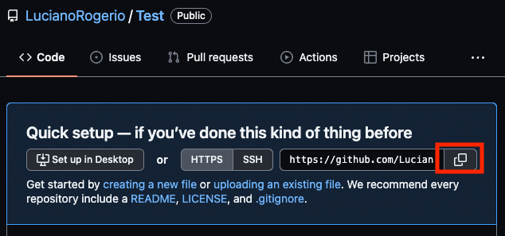{width="100%"}

<br>

Then let's move to RStudio.

To clone (Download) your repository from GitHub, click at the `Project` button on the top right of RStudio `(1˚)` then at `New Project...`.  
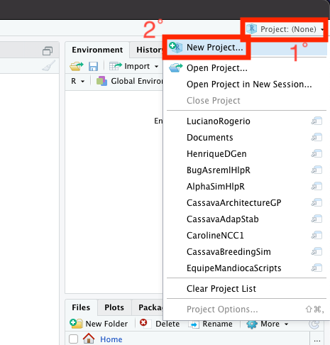{width="100%"}

<br>

A window named `New Project Wizard` will appear, select `Version Control`, then `Git`.  
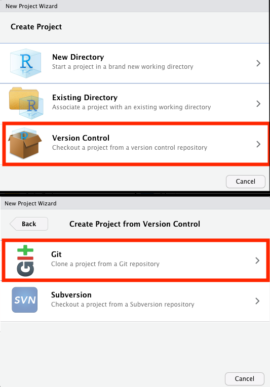{width="100%"}

<br>

This will open a window with the `Clone Git Repository`. Here you will just paste that link that I asked you to copy long time ago at the `Repository URL:` window. At the `Create project as subdirectory of:` select a directory of easy access for you, that will make it easier for you to locate it later.  

*I suggest you to create a folder at your `Documents` to keep your `workflowr` projects organized.*  
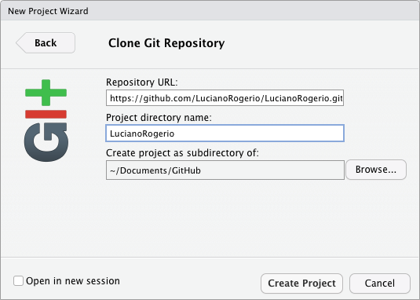{width="100%"}

<br>
<br>

## Create a `workflowr` project

`workflowr` package helps you to organize an analysis aiming to improve the project management, reproducibility, and team work. It works with the version control software git. Git is another incredible software that works as an version control, saving all the changes at your project that you make during the way, allowing to easily get back to older versions or track your changes or bugs.  

So let's start installing the `workflowr` package  
```{r Install workflowR, eval = FALSE}
install.packages("workflowr")
```

<br>

### Starting your workflowr project

Let's start reading the `workflowr` package, and then running its function  
```{r Configure GitHub, eval=FALSE}
library(workflowr)

wflow_git_config(user.name = "YourGitHubUserName", user.email = "YourGitHubEmail")

```

<br>

`wflow_git_config` function will save the yours information of username and email linked to your GitHub account. That will be required to allow you to push all your changes at your project. *This configuration will only be necessary once per computer.*

<br>
Then we are going to create the `workflowr` directory structure with the `wflow_start` function. *Just pay attention that you already have a main directory for your project, but if you follow my steps everything will be fine.*

```{r Start the project, eval = FALSE}
wflow_start(directory = ".",
          name = "YourRepositoryName",
          git = TRUE,
          existing = TRUE)
```
<br>

>Obs.:  
>
>1.  The dot `.` represents your working directory. It is saying to `workflowr` to create the new folders at your working directory, not in a new folder.  
>
>2.  Use the same `name` for your project as for your GitHub repository.  
>
>3.  `git` and `existing` arguments inform for `workflowr` that you will use git as version control and that the folder already exists, respectively.

<br>

`wflow_start` will provide the following template of sub directories:  
```
myproject/
|-- .gitignore
|-- .Rprofile
|-- _workflowr.yml
|-- analysis/ # This is the most important folder,
|   |            it will store all the your R markdown
|   |            files with your analysis of this project
|   |-- about.Rmd
|   |-- index.Rmd # This Rmd file will generate the homepage of your
|   |               website. Here you could write more about the 
|   |               project and link it to the your Rmd files with
|   |               your analysis
|   |-- license.Rmd
|   \-- _site.yml # This file is the does all the magic of your website
|                   layout, theme, navigation bar, ...
|-- code/ # This folder you should store all the code that you think
|   |       that might not be appropriate to include at your Rmd files
|   |       or that's functions that you created that you will just call
|   |       for the analysis using a source function.
|   \-- README.md
|-- data/ # Here you will add all your raw data files.
|   \-- README.md
|-- docs/ # This folder will save all the html pages created from your Rmd
|           files, SHOULD NOT BE EDITED BY THE USER
|-- myproject.Rproj
|-- output/ # Here you will save all the output from your analysis,
|   |         like data, results, figures,...
|   |         Even pre-process data files should be saved here.
|   \-- README.md
|-- README.md
```

<br>

`workflowr` also provide an template format for your Rmd files that could be used to create yours GitHub pages websites like this one!!!  
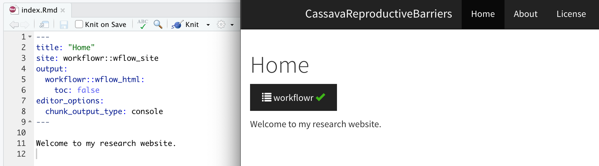{width="100%"} 

<br>

You can look more ideas of how to customize the theme and layout of your project website [here](https://workflowr.github.io/workflowr/articles/wflow-02-customization.html).  

<br>

## Tidyverse functions

There are *lots* of great resources online for learning the basic `tidyverse` functions.
[Here](https://www.rstudio.com/resources/cheatsheets/) you will find a lot of cheat sheets of the wonderful world of tidyverse and so much more.  

### Code chunks

At the R markdown files your R code must be inside a `code chunks` for RStudio to understand as so.
So What is a code chunk?  

>```
>Here's one
>```{r}
>dim(iris)
>```
>```

but you could also use that in the middle of any phrase as `2 + 2` is `r 2 + 2`, all you need to do is to write your code surrounded by a pair of back-ticks and the letter `r` like this.

```{r Chunk example}
# Two plus two equals `r 2 + 2`
```

R markdown allows you to create chunks for several programming languages, like python.
In your RStudio there is a `+c` button at the menu below your Rmd file name, try it to see which other type of languages you could apply at a Rmd file.

### Hotkeys

Pretty critical to learn a few of these, especially these:


|     **OS X - MAC**     |      **Windows**       |          Hotkey          |
| :--------------------: | :--------------------: | :----------------------: |
| `CMD` + `Option` + `I` | `Ctrl` + `Alt` + `I`   | create chunk             |
| `Shift` + `CMD` + `M`  | `Shift` + `Ctrl` + `M` | `%>%` pipe operator      |
| `Option` + `-`         | `Alt` + `-`            | `<-` assignment operator |
| `CMD` + `Enter`        | `Windows` + `Enter`    | submit (run) lines of code in your Rmd or R script to the console. |
|                        |                        |                          |

 
`magrittr` package has several operators very useful for managing data.

<br>

## Using Rmarkdown

Here is some guides to improve your Rmd writing.
You can use headers, give emphasis, create tables, call a figure, add links of useful websites.

* [Markdown Basic Syntax](https://www.markdownguide.org/basic-syntax/)  
* [R Markdown Reference Guide](https://www.rstudio.com/wp-content/uploads/2015/03/rmarkdown-reference.pdf?_ga=2.257912457.388466084.1647312703-2093965637.1647091994) - From RStudio.

<br>

## Using `workflowr`

We will open the `index.Rmd` file using `wflow_open` function

```{r Open an Rmd file, eval = FALSE}
wflow_open("analysis/index.Rmd")
```

<br>

At this file you can update the title of the index page, and start writing the main objectives of this repository. Like:

```
This repository was created to assist my learning experience with GitHub and workflowr.

My first R code at this project will be at this [git hub page](PCA.html)
```

<br>

That's great, but we still do not have the `PCA.hmtl` file, so let's create it with the `wflow_open` function.

```{r Create a new Rmd file, eval = FALSE}
wflow_open("analysis/PCA.Rmd")
```

That should create the PCA.Rmd file, you should be looking for it now.  
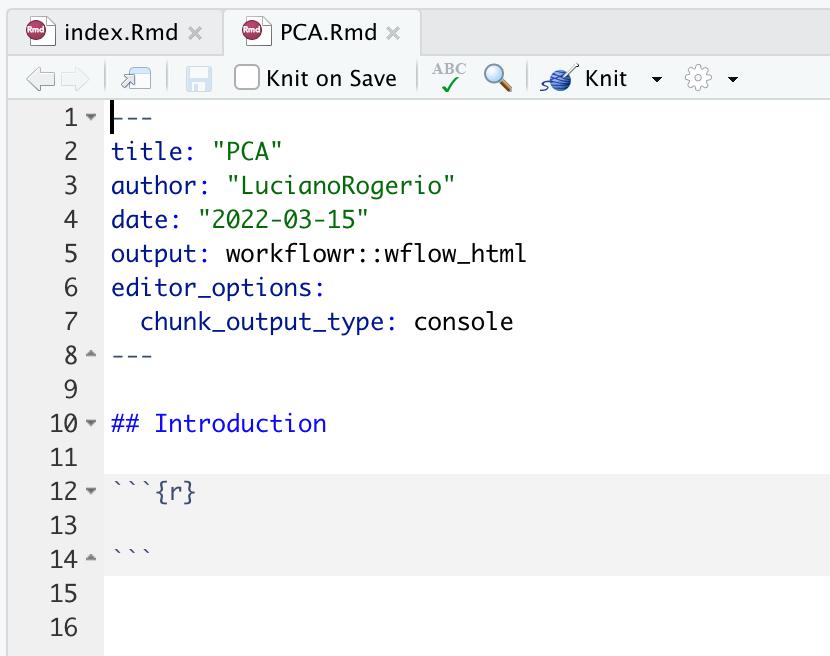{width="100%"}

<br>

You can update the name to replacing the abbreviation for `Principal Components Analysis`, and add a new intro for the analysis that we are going to do at this R markdown file.

You can follow the example of this website [WorkFlowRExample](https://lucianorogerio.github.io/WorkFlowRExample/).  

<br>

As we already have some changes at our project, we can update our repository in GitHub running the `wflow_status` and `wflow_publish`.

* `wflow_status` will check if there is any changes at the files of the `analysis` folder that requires to create the html pages again, and verify any new/delete/modified files at your repository. Always comparing with the last version (commit).

* `wflow_publish` will commit (save, take a snapshot) the changes at the Rmd files at the `analysis` folder. Then create or update the html files and figures, and commit these new html files and figures again.

```{r Workflow Status, eval = FALSE}
wflow_status()
```

You should see something like this.
```
Status of 4 Rmd files

Totals:
 3 Unpublished
 1 Scratch

The following Rmd files require attention:

Unp analysis/about.Rmd
Unp analysis/index.Rmd
Unp analysis/license.Rmd
Scr analysis/PCA.Rmd

Key: Unp = Unpublished, Scr = Scratch (Untracked)

The current Git status is:

    status substatus                                          file
 untracked untracked                                     .DS_Store
 untracked untracked                        2.1 Script Var BLUPs.R
 untracked untracked                Data_Crosses_Density_chart.txt
 untracked untracked                   Parentais selecionados.xlsx
```

<br>

To publish your html website using `wflow_publish` you will need to provide a small message that will be linked to the `git commit` function.

```{r WorkFlowR publish, eval = FALSE}
wflow_publish(files = "analysis/*.Rmd", message = "Test")
```

```
Current working directory: /Users/lbd54/Documents/GitHub/CassavaReproductiveBarriers
Building 3 file(s):
Building analysis/about.Rmd
log directory created: /var/folders/33/g0c9br3d0rx_bvhf9jsc0t9mcdw1j5/T//RtmphiTKma/workflowr
Building analysis/index.Rmd
Building analysis/license.Rmd
Summary from wflow_publish

**Step 1: Commit analysis files**

No files to commit


**Step 2: Build HTML files**

Summary from wflow_build

Settings:
 combine: "or" clean_fig_files: TRUE

The following were built externally each in their own fresh R session: 

docs/about.html
docs/index.html
docs/license.html

Log files saved in /var/folders/33/g0c9br3d0rx_bvhf9jsc0t9mcdw1j5/T//RtmphiTKma/workflowr

**Step 3: Commit HTML files**

Summary from wflow_git_commit

The following was run: 

  $ git add docs/about.html docs/index.html docs/license.html docs/figure/about.Rmd docs/figure/index.Rmd docs/figure/license.Rmd docs/site_libs docs/.nojekyll 
  $ git commit -m "Build site." 

The following file(s) were included in commit 96ce162:
docs/about.html
docs/index.html
docs/license.html
```

<br>

However, I prefer to create/update the html files using the Knit button, then commit myself. This strategy reduces the number of commits in your repository, which makes easier to find an older version of it. Also the Knit button allows you to see if your website has the configuration that you expected without requiring to commit each time you recreate your website.

You can ask for `RStudio` to create your html website pressing the button `knit`, as showed below.

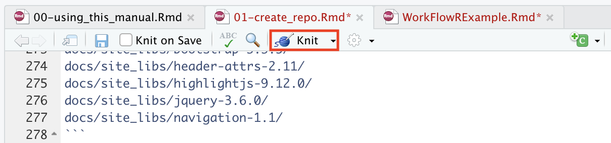{width="100%"}

<br>

`RStudio` will create/update your html file and save it at the `docs` folder. After you repeat this step for all your Rmd files and checking if all of them are as you expected, you can commit this changes to GitHub. See next section.

<br>

## Using Git to save your updates at GitHub

Git has four main functions:  

* clone: will copy your repository for an specific directory on your computer.  
* pull: will update the cloned repository of your computer with the new updates in your GitHub repository.  
* commit: will save a version of your repository with your new codes, files, outputs. *But that will not send it to GitHub*.  
* push: will send to git hub all your new commits/updates in project. After pushing your repository to GitHub you can share or clone your updates in any computer.

For a good commiting practice, just commit your updates after you finish your work or part of the project, so you will reduce the number of commits in your project.

### Git in RStudio

Git has it own menu to make easier the interaction between GitHub and RStudio.
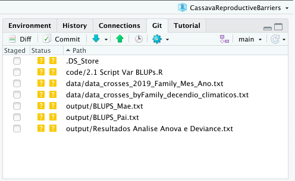{width="100%"}

<br>

To commit your updates just click at the commit button at this menu. This will open a window called `Rstudio: Review Changes`.
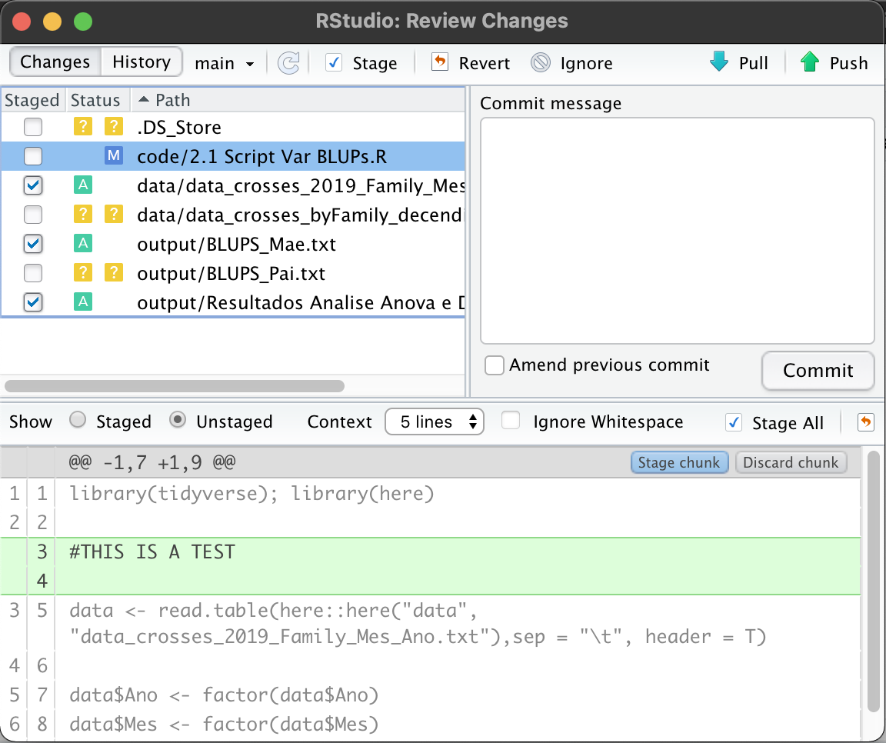{width="100%"}

<br>

At this window, you will be allowed to `stage` (confirm) the changes that you made in all the files. You can make this decision per chunk, you just have to decide if you `stage chunk` (keep the changes) or `discard chunk` (keep the file as it was at the last commit).  

>*DO NOT FORGET TO WRITE A SHORT MEANINGFUL MESSAGE ABOUT THE NEW CHANGES FOR THIS COMMIT*.  

Just click `commit` and then push your new commit to GitHub clicking at the `green arrow`.
If it is your first time push a commit to GitHub in your computer, RStudio will ask you your `GitHub user` and a `password`, the password you should provide is a `personal access token`. This [link](https://catalyst.zoho.com/help/tutorials/githubbot/generate-access-token.html) will provide what you need to do to generate one.  

>*Remember to save this token in a safe place, it might be used another time*.

<br>

## Publishing on GitHub (Pages)

Ok, your project is already at the GitHub, but now we need to give instructions to build your website to GitHub, so let's go to your GitHub repository. [GitHub link](https://github.com/)

At your repository website, click in `settings`
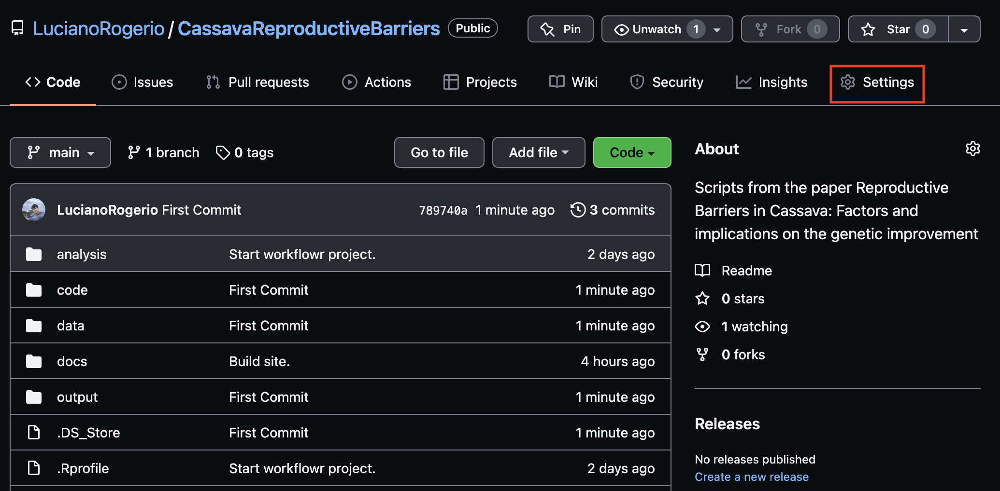{width="100%"}

<br>

Then select the `Pages` section at the sidebar menu
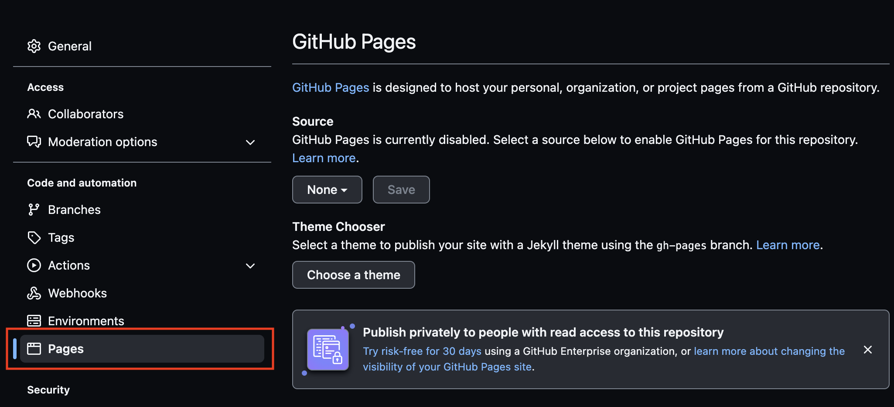{width="100%"}

<br>

You will see a section about `Source`, GitHub need to know which branch and which folder inside this branch is yours html files. So click at the `None` button and select `Branch: main`, then at the new windows with a folder symbol select `/docs` folder, and save.

{width="100%"}

<br>

Congratulations your website will be created, just wait some minutes. The link will appear in a window similar to this one.

```
®   Your site is ready to be published at
https://YourUserName.github.io/YourRepositoryName/
```

Copy this link, and get back to your repository website clicking at your repository name.

```
UserName/RepositoryName
```

at the right side of the page will have a section called about with a `gear`, click at the `gear` and paste your website link at the window `Website`, and save the changes.
Now everyone that have access to your repository could see your project website just clicking at the link provided at the about section.