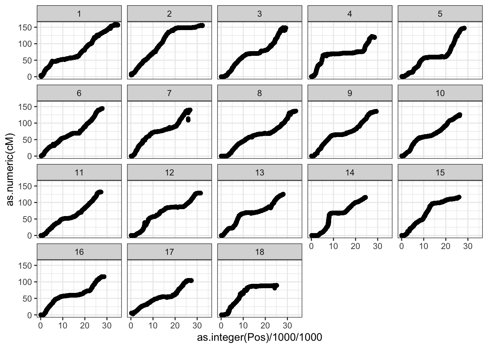

# Prepare genotypic data


-   **Context and Purpose:**

    -   Depending on whether parent- vs. mate-selection are intended, there are several formats to-be-constructed / computed from the downloaded genotypic data.
    -   Potentially, do exploratory / preliminary assessment of population structure, esp. any divergence between "training" samples and selection candidates ("test").

-   **Upstream:** Section \@ref(prepare-phenotype-data) - quality control steps for phenotype data

-   **Downstream:** All analyses relying on genotypic data

-   **Inputs:**

    -   For parent selection: An imputed allele-dosage matrix downloaded from BreedBase (`data/BreedBaseGenotypesDownload.tsv`)

    -   For mate selection:

        -   An imputed variant call format (VCF) file downloaded from BreedBase (`data/BreedBaseGenotypesDownload.vcf`)

        -   A centimorgan-scale genetic map with positions on the same reference genome version as the VCF. Can be sourced from the Cassavabase FTP, FTP archive, or another alternative.

-   **Expected outputs:**

    -   For parent selection: a MAF filtered, dosage matrix, possibly with some samples removed relative to the database download.

    -   For mate selection:

        -   a haplotype matrix extracted from the VCF

        -   a dosage matrix (computed from the haplotype matrix)

        -   a filtered SNP list

        -   Interpolated genetic map, a cM position for each SNP

    -   For parent and mate selection: genomic relationship matrices (GRMs, aka kinship matrices), possibly both additive *and* dominance relationship matrices, constructed based on the dosage matrix.

## Process Map

{width=100%}

## Parent vs. Mate Selection?

The following sections will exemplify the **genomic mate selection** as opposed to the somewhat simpler **genomic parent selection** pathway along the process map. This chapter can be simplified / mostly avoided if parent selection is sufficient.

## Learning command line navigation

- https://www.codecademy.com/learn/learn-the-command-line/modules/learn-the-command-line-navigation/cheatsheet
- [SSH Client on Windows 10 Using the Command Prompt | SSH from Windows to Linux and Other Systems](https://www.youtube.com/watch?v=JbMgOKlj5fE&ab_channel=SavvyNik)
- [Secure Copy Protocol (SCP) - Transfer Files using SSH & Command Line on Windows 10 to Linux / Other](https://www.youtube.com/watch?v=2u0I-U0D7Uk&ab_channel=SavvyNik)

## Remote access the server

These steps will vary a bit depending on your system. 

Instructions for BioHPC access are here: https://biohpc.cornell.edu/lab/doc/BioHPCLabexternal.pdf

First, remote login, using `ssh`

`ssh userid@serverid.biohpc.cornell.edu`

For example:


```bash
ssh mw489@cbsumm21.biohpc.cornell.edu
```

Input your password when prompted.


```bash
pwd
```

Should show something like `/home/mw489/` (but your userid)

## Set-up directories and transfer data

### Create a sub-folder for your analysis

Create a sub-folder for your analysis. I created one with same name as my example GitHub repository for this workshop, like so:


```bash
mkdir GSexample2022; 
cd GSexample2022; 
mkdir data;
mkdir output;
```

### [INSTRUCTOR'S STEP]: Transfer VCF to CBSU
Now, on my local computer, navigate in the command line to the `data/` subdirectory.

Use `scp` to transfer the VCF file downloaded from Cassavabase to the server.

Also copy the "cleaned_phenos.rds" from last week, which is in the `output/`:

```bash
scp BreedBaseGenotypesDownload.vcf mw489@cbsulogin.biohpc.cornell.edu:GSexample2022/data/
cd ../output;
scp phenotypes_cleaned.rds mw489@cbsulogin.biohpc.cornell.edu:GSexample2022/output/
```

### Copy data to `/workdir/`

Create a folder on the `/workdir/` directory of the CBSU server you've reserved with your username. 
Then copy the `GSexample2022` directory and its contents into that sub-folder.

**Here is my step, don't do this:**

```bash
mkdir /workdir/mw489/;
cd /workdir/mw489/;
cp -r ~/GSexample2022 .; 
```

**Here is your step, copy from my directory:**

Navigate into your subdirectory (empty now).

```bash
cd /workdir/userid/
```

Copy the VCF from my `data/` sub-dir. to yours.

```bash
cp /workdir/mw489/GSexample2022/data/BreedBaseGenotypesDownload.vcf data/
cp /workdir/mw489/GSexample2022/output/phenotypes_cleaned.rds output/
```

Check that its there.

```bash
ls data/
```

Now you should be ready to go.

## Introducing VCF files

Some links:

- https://en.wikipedia.org/wiki/Variant_Call_Format
- Detailed specifications: https://samtools.github.io/hts-specs/VCFv4.2.pdf
- VCF poster: http://vcftools.sourceforge.net/VCF-poster.pdf

Let's take a look at _our_ VCF file:


```bash
cat data/BreedBaseGenotypesDownload.vcf | head -n50 | cut -c1-100
```


## Check the VCF

Check the VCF 'manually'.

-   Are the number of samples and sites what you expected?


```bash
vcftools --vcf data/BreedBaseGenotypesDownload.vcf
# VCFtools - 0.1.16
# (C) Adam Auton and Anthony Marcketta 2009
# 
# Parameters as interpreted:
# 	--vcf data/BreedBaseGenotypesDownload.vcf
# 
# After filtering, kept 1207 out of 1207 Individuals
# After filtering, kept 61239 out of a possible 61239 Sites
# Run Time = 16.00 seconds
```

-   Are the data phased?
-   What FORMAT fields are present? At a minimum, should include GT field.
-   Do the column-names after FORMAT (should be sample names) look right / make sense?
-   Do the SNP IDs in the "ID" field make sense?


```bash
# look at the header of the VCF file
# print the "top-left" corner of the file
cat data/BreedBaseGenotypesDownload.vcf | head -n50 | cut -c1-100
```

## Subset VCF

-   There *may* be multiple imputed DNA samples corresponding to a single unique 'germplasmName'. For matching to the phenotypic observations in downstream analyses, a single entry in the VCF file must be chosen per 'germplasmName'.
-   Remove extraneous samples, if any.
-   **For example / tutorial purposes ONLY:** randomly sample and subset the number of SNPs to only a few thousand, for quick, local computations.

### Remove duplicate samples

Cassavabase returned multiple columns in the VCF file with the same column-name, because of multiple tissue_samples per germplasmName. This prevents using certain tools, e.g. `bcftools` which errors.

**Manual solution required:**

Write just the column-names of the VCF to disk. Here's a one-liner:


```bash
egrep "^#CHROM" data/BreedBaseGenotypesDownload.vcf | head -n1 > data/vcf_colnames.txt
# egrep "^##SynonymsOfAccessions=" data/BreedBaseGenotypesDownload.vcf | head -n1 > data/vcf_synonyms.txt
```

Read the column-names-file to R. Exclude the first 9 elements as they are standard VCF columns, not "germplasmName"


```r
vcf_sample_names<-readLines("data/vcf_colnames.txt") %>% 
     strsplit(.,"\t") %>% unlist() %>% 
     .[10:length(.)]
# Check how many sample names are duplicated?
table(duplicated(vcf_sample_names))
#> 
#> FALSE  TRUE 
#>   963   244
```

Quite a few duplicates.

Next, I (1) create unique names for each sample column in the VCF file, (2) write the "unique_names_for_vcf.txt" to disk and (3) use it to replace the current sample column names in the VCF. Finally, I (4) subset the VCF to only one unique instance of each name.

First, manipulate names using **R**.


```r
# create unique names for each VCF
unique_names_for_vcf<-tibble(vcfName=vcf_sample_names) %>% 
     # create an overall index to ensure I can recover the original column order
     mutate(vcfIndex=1:n()) %>% 
     # now for each vcfName create an sub-index, to distinguish among duplicates
     group_by(vcfName) %>% 
     # sub-index
     mutate(vcfNameIndex=1:n(),
            # For the first (or only) instance of each unique vcfName
            vcfName_Unique=ifelse(vcfNameIndex==1,
                                  # return the original name
                                  vcfName,
                                  # for all subsequent (duplicate) names, 
                                  #put a unique-ified name by pasting the sub-index
                                  paste0(vcfName,".",vcfNameIndex)))
# Write the "unique_names_for_vcf.txt" to disk
write.table(unique_names_for_vcf$vcfName_Unique,file = "data/unique_names_for_vcf.txt",
            row.names = F, col.names = F, quote = F)
# Create also a list containing only one instance of each unique name, the first instance 
subset_unique_names_for_vcf<-unique_names_for_vcf %>% 
     filter(vcfNameIndex==1) %$%
     vcfName_Unique
# Write that list to disk for subsetting the VCF downstream
write.table(subset_unique_names_for_vcf,file = "data/subset_unique_names_for_vcf.txt",
            row.names = F, col.names = F, quote = F)
```

Now in the command line:

`bcftools reheader` to replace the sample names in the VCF with the unique ones.


```bash
# replace sample names in original VCF with unique ones (creates a new VCF)
bcftools reheader --samples data/unique_names_for_vcf.txt data/BreedBaseGenotypesDownload.vcf > data/BreedBaseGenotypesDownload_1.vcf; 
# overwrite the original VCF with the new  that has unique names
mv data/BreedBaseGenotypesDownload_1.vcf data/BreedBaseGenotypesDownload.vcf;
# check that the names are now unique by printing sample list
bcftools query --list-samples data/BreedBaseGenotypesDownload.vcf
```

Now subset the VCF to only a single instance of each "germplasmName" with `vcftools`.


```bash
vcftools --vcf data/BreedBaseGenotypesDownload.vcf --keep data/subset_unique_names_for_vcf.txt --recode --stdout | bgzip -c > data/BreedBaseGenotypes_subset.vcf.gz
# uses stdout and bgzip to output a gzipped vcf file; saves disk space!
```


```bash
vcftools --gzvcf data/BreedBaseGenotypes_subset.vcf.gz
#VCFtools - 0.1.16
#(C) Adam Auton and Anthony Marcketta 2009
# Parameters as interpreted:
# 	--gzvcf data/BreedBaseGenotypes_subset.vcf.gz
# 
# Using zlib version: 1.2.11
# After filtering, kept 963 out of 963 Individuals
# After filtering, kept 61239 out of a possible 61239 Sites
# Run Time = 2.00 seconds
```

### Check genotype-to-phenotype matches

-   Do the number of unique **germplasmName** (in the \[cleaned phenos from the previous step\]\[save_cleaned_phenos\]) matching samples in the VCF make sense? Are there as many as expected? If not, you will need to figure out why not.


```r
phenos<-readRDS(here::here("output","phenotypes_cleaned.rds"))

# vector of the unique germplasmName in the field trial data
germplasm_with_phenos<-unique(phenos$germplasmName)
length(germplasm_with_phenos) 
#> [1] 1002
```

How many matches to the VCF?


```r
table(germplasm_with_phenos %in% subset_unique_names_for_vcf)
#> 
#> FALSE  TRUE 
#>   652   350
```

350 matches. Does that make sense? Yes. We ended up excluding the "genetic gain" trial from the phenotypes b/c actually there were no trait scores.

To be sure, I look at the names of: (1) the genotyped *and* phenotyped, (2) the genotyped *but not* phenotyped, (3) the phenotyped *but not* genotyped.


```r
# geno and pheno
subset_unique_names_for_vcf[subset_unique_names_for_vcf %in% germplasm_with_phenos]
# pheno not geno
germplasm_with_phenos[!germplasm_with_phenos %in% subset_unique_names_for_vcf]
# geno not pheno
subset_unique_names_for_vcf[!subset_unique_names_for_vcf %in% germplasm_with_phenos]
```

To diagnose some the phenotyped-but-not-genotyped, I actually resorted to searching a few on Cassavabase to verify that there were non-genotyped lines in the trials I downloaded.

For the genotyped-but-not-phenotyped, indeed the names are all "genetic gain" population clones.

**Probably the details above will change if I go back and choose better example trials.**

**The checklist and approach to verifying it all should stay the same.**

### Subset SNPs (for tutorial purposes)

**For example / tutorial purposes ONLY:** randomly sample and subset the number of SNPs to only a few thousand, for quick, local computations.


```bash
# write the positions list
# first two columns (chrom. and position) of the VCF 
# ignoring the header rows
cat data/BreedBaseGenotypesDownload.vcf | grep -v "^#" | cut -f1-2 > data/BreedBaseGenotypesDownload.positions
```

Read into R, sample 4000 at random


```r
set.seed(1234)
read.table(here::here("data","BreedBaseGenotypesDownload.positions"), 
           header = F, stringsAsFactors = F) %>% 
     dplyr::slice_sample(n=4000) %>% 
     arrange(V1,V2) %>% 
     write.table(.,file = "data/BreedBaseGenotypes_subset.positions",
                 row.names = F, col.names = F, quote = F)
```

Subset the VCF using the randomly sampled list of positions.


```bash
vcftools --vcf data/BreedBaseGenotypesDownload.vcf \
--keep data/subset_unique_names_for_vcf.txt \
--positions data/BreedBaseGenotypes_subset.positions \
--recode --stdout | bgzip -c > data/BreedBaseGenotypes_subset.vcf.gz
# VCFtools - 0.1.16
# (C) Adam Auton and Anthony Marcketta 2009
# 
# Parameters as interpreted:
# 	--vcf data/BreedBaseGenotypesDownload.vcf
# 	--keep data/subset_unique_names_for_vcf.txt
# 	--positions data/BreedBaseGenotypes_subset.positions
# 	--recode
# 	--stdout
# 
# Keeping individuals in 'keep' list
# After filtering, kept 963 out of 1207 Individuals
# Outputting VCF file...
# After filtering, kept 4000 out of a possible 61239 Sites
# Run Time = 8.00 seconds
```

### LD-prunning SNPs (for computational savings)

**NOT DEMONSTRATED HERE, YET.** In practice, when predicting cross-variances, it can still be very computationally intensive with large numbers of markers. [Previously](https://wolfemd.github.io/IITA_2021GS/04-PreprocessDataFiles.html#Variant_filters), I used `plink --indep-pairwise` to prune markers based on linkage disequilibrium. I [found an LD-prunned subset that had similar accuracy to the full set](https://wolfemd.github.io/IITA_2021GS/07-Results.html#Prediction_accuracy_estimates), but less than half the markers. Subsequently, I used the full set to predict cross means, but the LD-pruned marker subset for the cross variances [predictions of \>250K crosses of 719 candidate parents in IITA's 2021 crossing block](https://wolfemd.github.io/IITA_2021GS/07-Results.html#Genomic_Predictions).

## Haplotype matrix from VCF

Extract haplotypes from VCF with `bcftools convert --hapsample`


```bash
bcftools convert --hapsample data/BreedBaseGenotypes_subset data/BreedBaseGenotypes_subset.vcf.gz
# Hap file: data/BreedBaseGenotypes_subset.hap.gz
# Sample file: data/BreedBaseGenotypes_subset.samples
# [W::vcf_parse_format] FORMAT 'NT' at 1:652699 is not defined in the header, assuming Type=String
# 4000 records written, 0 skipped: 0/0/0 no-ALT/non-biallelic/filtered
```

Read haps to R and format them.


```r
library(data.table)
#> 
#> Attaching package: 'data.table'
#> The following objects are masked from 'package:dplyr':
#> 
#>     between, first, last
#> The following object is masked from 'package:purrr':
#> 
#>     transpose
vcfName<-"BreedBaseGenotypes_subset"
haps<-fread(paste0("data/",vcfName,".hap.gz"),
            stringsAsFactors = F,header = F) %>% 
  as.data.frame
sampleids<-fread(paste0("data/",vcfName,".samples"),
                 stringsAsFactors = F,header = F,skip = 2) %>% 
  as.data.frame
```

Add sample ID's.


```r
hapids<-sampleids %>% 
     select(V1,V2) %>% 
     mutate(SampleIndex=1:nrow(.)) %>% 
     rename(HapA=V1,HapB=V2) %>% 
     pivot_longer(cols=c(HapA,HapB),
                  names_to = "Haplo",values_to = "SampleID") %>% 
     mutate(HapID=paste0(SampleID,"_",Haplo)) %>% 
     arrange(SampleIndex)
colnames(haps)<-c("Chr","HAP_ID","Pos","REF","ALT",hapids$HapID)
dim(haps)
#> [1] 4000 1931
```

Format, transpose, convert to matrix.


```r
haps %<>% 
     mutate(HAP_ID=gsub(":","_",HAP_ID)) %>% 
     column_to_rownames(var = "HAP_ID") %>% 
     select(-Chr,-Pos,-REF,-ALT) %>% 
     t(.) %>% 
     as.matrix(.)
```

## Dosage matrix from haps

To ensure consistency in allele counting, create dosage from haps manually.

The counted allele in the dosage matrix, which will be used downstream to construct kinship matrices and estimate marker effects, should be the ALT allele. This will ensure a match to the haplotype matrix, where a "1" indicates the presence of the ALT allele.

The BreedBase system currently (as of Jan. 2022) gives dosages that count the REF allele and we need to fix this.

Here's my tidyverse-based approach, using `group_by()` plus `summarise()` to sum the two haplotypes for each individual across all loci.


```r
dosages<-haps %>%
     as.data.frame(.) %>% 
     rownames_to_column(var = "GID") %>% 
     separate(GID,c("SampleID","Haplo"),"_Hap",remove = T) %>% 
     select(-Haplo) %>% 
     group_by(SampleID) %>% 
     summarise(across(everything(),~sum(.))) %>% 
     ungroup() %>% 
     column_to_rownames(var = "SampleID") %>% 
     as.matrix %>% 
     # preserve same order as in haps
     .[sampleids$V1,]
dim(dosages)
#> [1]  963 4000
# [1]  963 4000

dosages[1:5,1:5]
#>                    1_652699_G_C 1_868970_G_T 1_943129_T_A
#> IITA-TMS-IBA30572             1            0            0
#> IITA-TMS-IBA940237            0            0            1
#> IITA-TMS-IBA961642            1            1            0
#> IITA-TMS-ONN920168            0            0            0
#> IITA-TMS-WAR4080              1            0            0
#>                    1_1132830_A_T 1_1310706_A_T
#> IITA-TMS-IBA30572              1             0
#> IITA-TMS-IBA940237             1             1
#> IITA-TMS-IBA961642             2             0
#> IITA-TMS-ONN920168             0             0
#> IITA-TMS-WAR4080               1             0
```


```r
haps[1:10,1:5]
#>                         1_652699_G_C 1_868970_G_T
#> IITA-TMS-IBA30572_HapA             1            0
#> IITA-TMS-IBA30572_HapB             0            0
#> IITA-TMS-IBA940237_HapA            0            0
#> IITA-TMS-IBA940237_HapB            0            0
#> IITA-TMS-IBA961642_HapA            1            0
#> IITA-TMS-IBA961642_HapB            0            1
#> IITA-TMS-ONN920168_HapA            0            0
#> IITA-TMS-ONN920168_HapB            0            0
#> IITA-TMS-WAR4080_HapA              0            0
#> IITA-TMS-WAR4080_HapB              1            0
#>                         1_943129_T_A 1_1132830_A_T
#> IITA-TMS-IBA30572_HapA             0             1
#> IITA-TMS-IBA30572_HapB             0             0
#> IITA-TMS-IBA940237_HapA            0             0
#> IITA-TMS-IBA940237_HapB            1             1
#> IITA-TMS-IBA961642_HapA            0             1
#> IITA-TMS-IBA961642_HapB            0             1
#> IITA-TMS-ONN920168_HapA            0             0
#> IITA-TMS-ONN920168_HapB            0             0
#> IITA-TMS-WAR4080_HapA              0             0
#> IITA-TMS-WAR4080_HapB              0             1
#>                         1_1310706_A_T
#> IITA-TMS-IBA30572_HapA              0
#> IITA-TMS-IBA30572_HapB              0
#> IITA-TMS-IBA940237_HapA             0
#> IITA-TMS-IBA940237_HapB             1
#> IITA-TMS-IBA961642_HapA             0
#> IITA-TMS-IBA961642_HapB             0
#> IITA-TMS-ONN920168_HapA             0
#> IITA-TMS-ONN920168_HapB             0
#> IITA-TMS-WAR4080_HapA               0
#> IITA-TMS-WAR4080_HapB               0
```

## Variant filters {#filter-variants}

In this case, simple: keep only positions with \>1% minor allele frequency.


```r
# use function built into genomicMateSelectR
dosages<-maf_filter(dosages,thresh = 0.01)
dim(dosages)
#> [1]  963 3986
# subset haps to match
haps<-haps[,colnames(dosages)]
```

### Save dosages and haps


```r
saveRDS(dosages,file=here::here("data","dosages.rds"))
saveRDS(haps,file=here::here("data","haplotypes.rds"))
```

## Genomic Relationship Matrices (GRMs) {#construct-grms}

In the example below, I use the `genomicMateSelectR` function `kinship()` to construct **additive** (A) and **dominance** (D) relationship matrices.


```r
A<-kinship(dosages,type="add")
D<-kinship(dosages,type="domGenotypic")
saveRDS(A,file=here::here("output","kinship_add.rds"))
saveRDS(D,file=here::here("output","kinship_dom.rds"))
```

For more information on the models to-be-implemented downstream, see [this vignette for **genomicMateSelectR**](https://wolfemd.github.io/genomicMateSelectR/articles/non_additive_models.html#genetic-models-implemented-1), the references cited therein.

## Recombination Frequency Matrix {#recomb-freq-mat}

Matrix needed for cross-variance predictions.

### Source a genetic map

-   Must match the reference genome of the marker set to be used in prediction
-   Not necessarily the exact markerset, but overlap is ideal

I source a single genome-wide file representing the ICGMC concensus genetic map on the V6 Cassava Reference genome. The file is on the Cassavabase FTP-archive, [here](https://cassavabase.org/ftp/marnin_datasets/NGC_BigData/CassavaGeneticMap/cassava_cM_pred.v6.allchr.txt).


```r
genmap<-read.table("https://cassavabase.org/ftp/marnin_datasets/NGC_BigData/CassavaGeneticMap/cassava_cM_pred.v6.allchr.txt",
                   header = F, sep=';', stringsAsFactors = F) %>% 
     rename(SNP_ID=V1,Pos=V2,cM=V3) %>% 
  as_tibble
genmap %>% dim
#> [1] 120979      3
```

120K positions.


```r
genmap %>% head
#> # A tibble: 6 × 3
#>   SNP_ID     Pos    cM
#>   <chr>    <int> <dbl>
#> 1 S1_26576 26576   2.7
#> 2 S1_26624 26624   2.7
#> 3 S1_26659 26659   2.7
#> 4 S1_27720 27720   2.7
#> 5 S1_27739 27739   2.7
#> 6 S1_27746 27746   2.7
```


```r
snps_genmap<-tibble(DoseSNP_ID=colnames(dosages)) %>% 
     separate(DoseSNP_ID,c("Chr","Pos","Ref","Alt"),remove = F) %>% 
     mutate(SNP_ID=paste0("S",Chr,"_",Pos)) %>% 
     full_join(genmap %>% 
                    separate(SNP_ID,c("Chr","POS"),"_",remove = F) %>% 
                    select(-POS) %>% 
                    mutate(Chr=gsub("S","",Chr)) %>% 
                    mutate(across(everything(),as.character)))
#> Joining, by = c("Chr", "Pos", "SNP_ID")
snps_genmap %>% 
  ggplot(.,aes(x=as.integer(Pos)/1000/1000,y=as.numeric(cM))) +
  geom_point() +
  theme_bw() +
  facet_wrap(~as.integer(Chr))
#> Warning: Removed 1567 rows containing missing values
#> (geom_point).
```



### Interpolate genetic map


```r
interpolate_genmap<-function(data){
  # for each chromosome map
  # find and _decrements_ in the genetic map distance
  # fix them to the cumulative max to force map to be only increasing
  # fit a spline for each chromosome
  # Use it to predict values for positions not previously on the map
  # fix them AGAIN (in case) to the cumulative max, forcing map to only increase
  data_forspline<-data %>% 
    filter(!is.na(cM)) %>% 
    mutate(cumMax=cummax(cM),
           cumIncrement=cM-cumMax) %>% 
    filter(cumIncrement>=0) %>% 
    select(-cumMax,-cumIncrement)
  
  spline<-data_forspline %$% smooth.spline(x=Pos,y=cM,spar = 0.75)
  
  splinemap<-predict(spline,x = data$Pos) %>% 
    as_tibble(.) %>% 
    rename(Pos=x,cM=y) %>% 
    mutate(cumMax=cummax(cM),
           cumIncrement=cM-cumMax) %>% 
    mutate(cM=cumMax) %>% 
    select(-cumMax,-cumIncrement)
  
  return(splinemap) 
}
```


```r
splined_snps_genmap<-snps_genmap %>% 
  select(-cM) %>% 
  mutate(Pos=as.numeric(Pos)) %>% 
  left_join(snps_genmap %>% 
              mutate(across(c(Pos,cM),as.numeric)) %>% 
              arrange(Chr,Pos) %>% 
              nest(-Chr) %>% 
              mutate(data=map(data,interpolate_genmap)) %>% 
              unnest(data)) %>% 
  distinct
#> Warning: All elements of `...` must be named.
#> Did you want `data = c(DoseSNP_ID, Pos, Ref, Alt, SNP_ID, cM)`?
#> Joining, by = c("Chr", "Pos")
```


```r
all(colnames(dosages) %in% splined_snps_genmap$DoseSNP_ID)
#> [1] TRUE
```


```r
splined_snps_genmap %>% 
     filter(DoseSNP_ID %in% colnames(dosages)) %>% 
     mutate(Map="Spline") %>% 
     bind_rows(snps_genmap %>% 
                    filter(DoseSNP_ID %in% colnames(dosages),
                           !is.na(cM)) %>% 
                    mutate(across(c(Pos,cM),as.numeric)) %>% 
                    arrange(Chr,Pos) %>% mutate(Map="Data")) %>% 
  ggplot(.,aes(x=Pos/1000/1000,y=cM,color=Map, shape=Map),alpha=0.3,size=0.75) + 
  geom_point() + 
  theme_bw() + facet_wrap(~as.integer(Chr), scales='free_x')
```


Save the interpolated map, just for the marker loci to-be-used downstream.


```r
splined_snps_genmap %>% 
     filter(DoseSNP_ID %in% colnames(dosages)) %>% 
     saveRDS(.,file=here::here("output","interpolated_genmap.rds"))
```

### Recomb. freq. matrix


```r
genmap<-readRDS(file=here::here("output","interpolated_genmap.rds"))
m<-genmap$cM;
names(m)<-genmap$DoseSNP_ID
recombFreqMat<-1-(2*genmap2recombfreq(m,nChr = 18))
saveRDS(recombFreqMat,file=here::here("output","recombFreqMat_1minus2c.rds"))
```

See also, [**genomicMateSelectR** vignette](https://wolfemd.github.io/genomicMateSelectR/articles/start_here.html#recombination-frequency-matrix-1).
