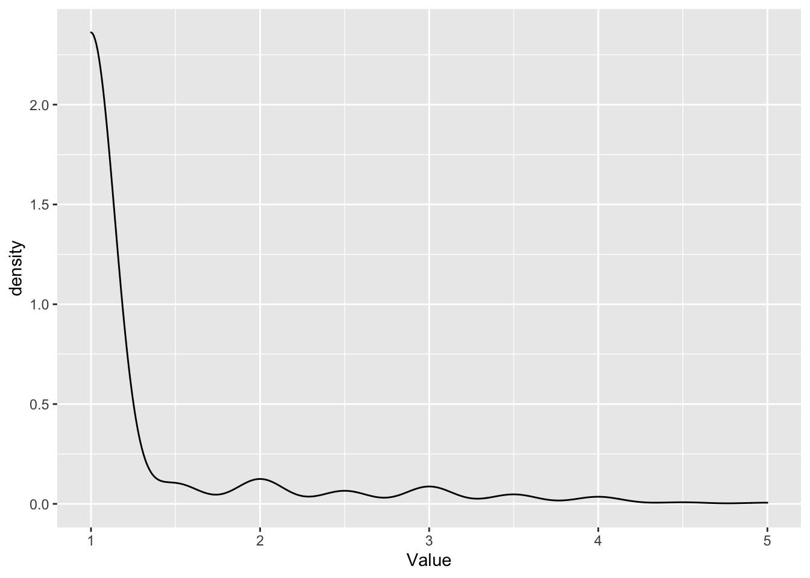
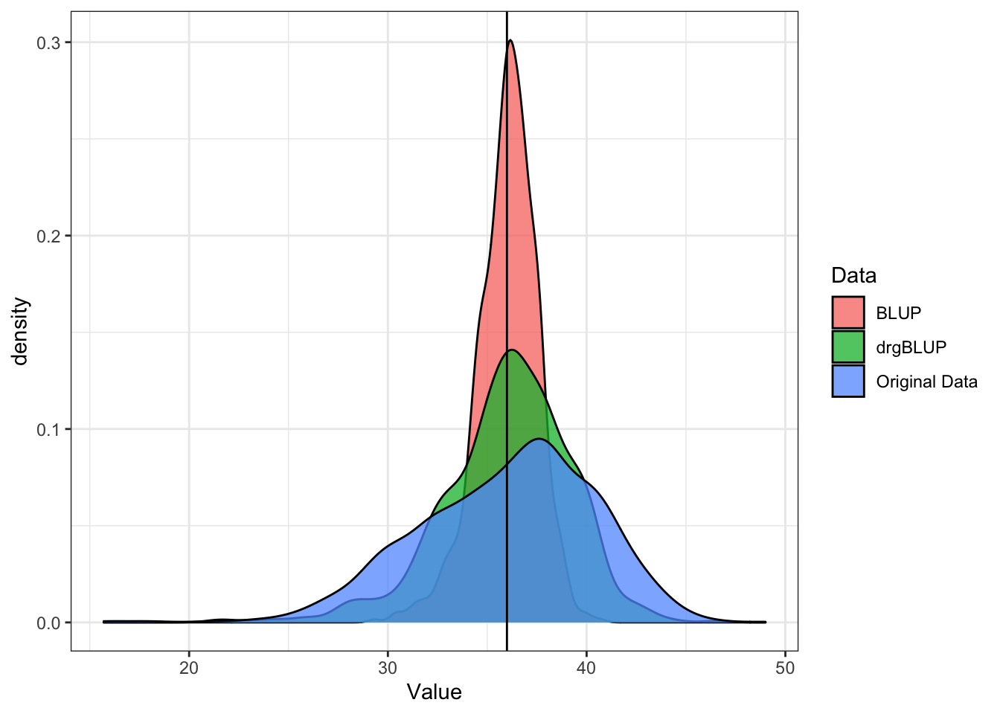
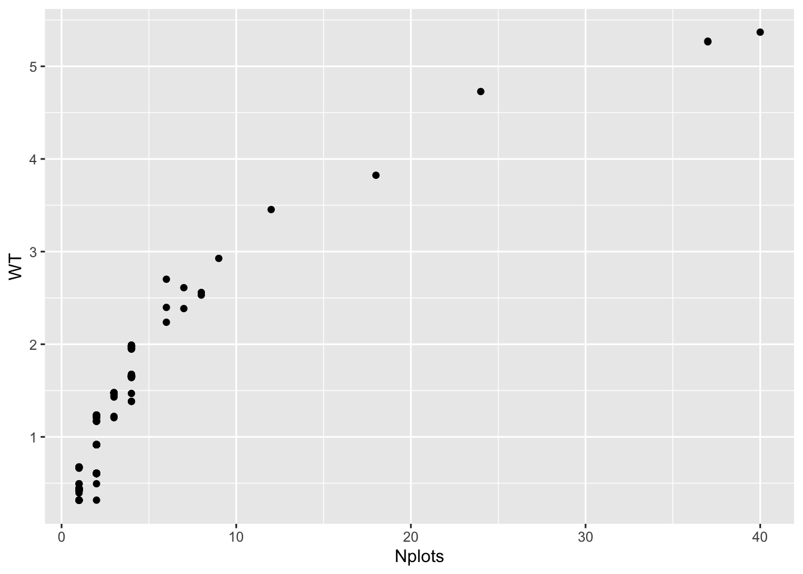

# Preliminary field trial analysis


-   **Context and Purpose:**

-   **Upstream:** Section \@ref(prepare-genotypic-data) - quality control steps for genotypic data

-   **Downstream:** Genomic prediction and related analyses.

-   **Inputs:**

-   **Expected outputs:**

## One-stage or multi-stage?

We often have very large, multi-year, multi-location, multi-trial-type (**MET**) datasets we use to train genomic prediction models. The number of plots can be in the range of 10- or even 100,000 plots with many thousands of unique genotypes observed in unbalanced fashion across heterogenous experimental designs. All that to say, the computational burden and level of expertise required to execute genomic prediction analyses directly on these data is very great.

For the sake of semi-automation and computational efficiency, the standard genomic prediction pipeline I have implemented for NextGen Cassava, which I demonstrate below is a two-stage weighted genomic prediction:

**Stage 1. Get BLUPs**

-   Conduct preliminary analysis of the trial data *without* genomic relatedeness / marker-information.

    Identify the best-fitting model for the data and potentially curate the raw data, removing outliers.

-   Fit mixed-model to **MET** data. Extract **`BLUPs`**, **`PEVs`** and variance components (**`VarComps`**). Compute de-regressed BLUPs (**`drgBLUPs`**) and weights (**`WTS`**) for "Stage 2".

**Stage 2. Cross-validation and genomic prediction**

Conduct weighted cross-validation and genomic prediction analyses using **`de-regressed BLUPs`** (alternative **`BLUEs`**) as the response variable and the weights from Stage 1. This effectively reduces the number of "observations" in the analysis to the number of unique genotypes (i.e. clones, inbred lines, etc.), leading to lower computational burden.

**Note of advice for single-stage analyses:** I strongly recommend conducting preliminary analysis of the trial data *without* genomic relatedeness / marker-information. Ensure the model will converge, residuals look acceptable and otherwise assess the best fitting model *before* committing to lengthy computationally intensive analyses. :)

## Set-up training datasets


```r
phenos<-readRDS(here::here("output","phenotypes_cleaned.rds"))
```

The pipeline version of this analysis will use the `TRUE/FALSE` values of **`CompleteBlocks`** and **`IncompleteBlocks`** ([Preliminary analysis of trial data](#detect_designs) ).


```r
phenos %>% 
     count(CompleteBlocks,IncompleteBlocks,locationName) %>% 
     spread(locationName,n)
#> # A tibble: 3 × 4
#>   CompleteBlocks IncompleteBlocks Ibadan Ubiaja
#>   <lgl>          <lgl>             <int>  <int>
#> 1 FALSE          TRUE                777     NA
#> 2 TRUE           FALSE                NA    125
#> 3 TRUE           TRUE                407    414
```

Convert the data to "long format" . Remove missing values. "Nest" the data by Trait.


```r
traits<-c("DM","MCMDS","logFYLD","logDYLD")
phenos<-phenos %>% 
     # Convert the data to "long format" 
     pivot_longer(cols = all_of(traits), 
                  names_to = "Trait", values_to = "Value") %>%
     # Remove missing values
     filter(!is.na(Value)) %>%
     # Nest the MultiEnvironmentTrial data by trait
     nest(METdata=c(-Trait))
phenos %>% 
     mutate(N_plots=map_dbl(METdata,nrow))
#> # A tibble: 4 × 3
#>   Trait   METdata               N_plots
#>   <chr>   <list>                  <dbl>
#> 1 DM      <tibble [1,448 × 35]>    1448
#> 2 MCMDS   <tibble [1,436 × 35]>    1436
#> 3 logFYLD <tibble [1,590 × 35]>    1590
#> 4 logDYLD <tibble [1,443 × 35]>    1443
```

Where previously there was one row per plot and a large number of columns, now things are simple and tidy.

One row per trait. The actual plot-basis data are now contained within **METdata**, a list-type column, each element containing a `tibble`.

To demonstrate, check the contents of row 1 of the **METdata** column:


```r
phenos$METdata[[1]] %>% head %>% rmarkdown::paged_table()
```

<div data-pagedtable="false">
  <script data-pagedtable-source type="application/json">
{"columns":[{"label":["studyYear"],"name":[1],"type":["int"],"align":["right"]},{"label":["programName"],"name":[2],"type":["chr"],"align":["left"]},{"label":["locationName"],"name":[3],"type":["chr"],"align":["left"]},{"label":["studyName"],"name":[4],"type":["chr"],"align":["left"]},{"label":["studyDesign"],"name":[5],"type":["chr"],"align":["left"]},{"label":["plotWidth"],"name":[6],"type":["int"],"align":["right"]},{"label":["plotLength"],"name":[7],"type":["dbl"],"align":["right"]},{"label":["fieldSize"],"name":[8],"type":["dbl"],"align":["right"]},{"label":["plantingDate"],"name":[9],"type":["chr"],"align":["left"]},{"label":["harvestDate"],"name":[10],"type":["chr"],"align":["left"]},{"label":["germplasmName"],"name":[11],"type":["chr"],"align":["left"]},{"label":["observationUnitDbId"],"name":[12],"type":["int"],"align":["right"]},{"label":["replicate"],"name":[13],"type":["int"],"align":["right"]},{"label":["blockNumber"],"name":[14],"type":["int"],"align":["right"]},{"label":["plotNumber"],"name":[15],"type":["int"],"align":["right"]},{"label":["rowNumber"],"name":[16],"type":["int"],"align":["right"]},{"label":["colNumber"],"name":[17],"type":["int"],"align":["right"]},{"label":["entryType"],"name":[18],"type":["chr"],"align":["left"]},{"label":["trialType"],"name":[19],"type":["chr"],"align":["left"]},{"label":["numberBlocks"],"name":[20],"type":["int"],"align":["right"]},{"label":["numberReps"],"name":[21],"type":["int"],"align":["right"]},{"label":["observationUnitName"],"name":[22],"type":["chr"],"align":["left"]},{"label":["CompleteBlocks"],"name":[23],"type":["lgl"],"align":["right"]},{"label":["IncompleteBlocks"],"name":[24],"type":["lgl"],"align":["right"]},{"label":["yearInLoc"],"name":[25],"type":["chr"],"align":["left"]},{"label":["trialInLocYr"],"name":[26],"type":["chr"],"align":["left"]},{"label":["repInTrial"],"name":[27],"type":["chr"],"align":["left"]},{"label":["blockInRep"],"name":[28],"type":["chr"],"align":["left"]},{"label":["NOHAV"],"name":[29],"type":["dbl"],"align":["right"]},{"label":["plotArea"],"name":[30],"type":["dbl"],"align":["right"]},{"label":["MaxNOHAV"],"name":[31],"type":["dbl"],"align":["right"]},{"label":["plantsPerPlot"],"name":[32],"type":["dbl"],"align":["right"]},{"label":["PlantSpacing"],"name":[33],"type":["dbl"],"align":["right"]},{"label":["PropNOHAV"],"name":[34],"type":["dbl"],"align":["right"]},{"label":["Value"],"name":[35],"type":["dbl"],"align":["right"]}],"data":[{"1":"2019","2":"IITA","3":"Ubiaja","4":"19.GS.C1.C2.C3.AYT.42.UB","5":"Alpha","6":"4","7":"4","8":"0.202","9":"2019-July-09","10":"2020-July-20","11":"IITA-TMS-IBA000070","12":"1929317","13":"1","14":"1","15":"112","16":"1","17":"12","18":"check","19":"NA","20":"NA","21":"NA","22":"2020-19.GS.C1.C2.C3.AYT.42.UB-rep1-IITA-TMS-IBA000070_112","23":"TRUE","24":"FALSE","25":"IITA_Ubiaja_2019","26":"IITA_Ubiaja_2019_19.GS.C1.C2.C3.AYT.42.UB","27":"IITA_Ubiaja_2019_19.GS.C1.C2.C3.AYT.42.UB_1","28":"IITA_Ubiaja_2019_19.GS.C1.C2.C3.AYT.42.UB_1_1","29":"10","30":"16","31":"10","32":"10","33":"1.6","34":"1.0","35":"30.7"},{"1":"2019","2":"IITA","3":"Ubiaja","4":"19.GS.C1.C2.C3.AYT.42.UB","5":"Alpha","6":"4","7":"4","8":"0.202","9":"2019-July-09","10":"2020-July-20","11":"IITA-TMS-IBA30572","12":"1929280","13":"1","14":"1","15":"119","16":"1","17":"10","18":"check","19":"NA","20":"NA","21":"NA","22":"2020-19.GS.C1.C2.C3.AYT.42.UB-rep1-IITA-TMS-IBA30572_119","23":"TRUE","24":"FALSE","25":"IITA_Ubiaja_2019","26":"IITA_Ubiaja_2019_19.GS.C1.C2.C3.AYT.42.UB","27":"IITA_Ubiaja_2019_19.GS.C1.C2.C3.AYT.42.UB_1","28":"IITA_Ubiaja_2019_19.GS.C1.C2.C3.AYT.42.UB_1_1","29":"10","30":"16","31":"10","32":"10","33":"1.6","34":"1.0","35":"32.6"},{"1":"2019","2":"IITA","3":"Ubiaja","4":"19.GS.C1.C2.C3.AYT.42.UB","5":"Alpha","6":"4","7":"4","8":"0.202","9":"2019-July-09","10":"2020-July-20","11":"IITA-TMS-IBA980581","12":"1929212","13":"1","14":"1","15":"128","16":"1","17":"1","18":"check","19":"NA","20":"NA","21":"NA","22":"2020-19.GS.C1.C2.C3.AYT.42.UB-rep1-IITA-TMS-IBA980581_128","23":"TRUE","24":"FALSE","25":"IITA_Ubiaja_2019","26":"IITA_Ubiaja_2019_19.GS.C1.C2.C3.AYT.42.UB","27":"IITA_Ubiaja_2019_19.GS.C1.C2.C3.AYT.42.UB_1","28":"IITA_Ubiaja_2019_19.GS.C1.C2.C3.AYT.42.UB_1_1","29":"10","30":"16","31":"10","32":"10","33":"1.6","34":"1.0","35":"31.8"},{"1":"2019","2":"IITA","3":"Ubiaja","4":"19.GS.C1.C2.C3.AYT.42.UB","5":"Alpha","6":"4","7":"4","8":"0.202","9":"2019-July-09","10":"2020-July-20","11":"IITA-TMS-IBA982101","12":"1929309","13":"1","14":"1","15":"138","16":"1","17":"10","18":"check","19":"NA","20":"NA","21":"NA","22":"2020-19.GS.C1.C2.C3.AYT.42.UB-rep1-IITA-TMS-IBA982101_138","23":"TRUE","24":"FALSE","25":"IITA_Ubiaja_2019","26":"IITA_Ubiaja_2019_19.GS.C1.C2.C3.AYT.42.UB","27":"IITA_Ubiaja_2019_19.GS.C1.C2.C3.AYT.42.UB_1","28":"IITA_Ubiaja_2019_19.GS.C1.C2.C3.AYT.42.UB_1_1","29":"8","30":"16","31":"10","32":"10","33":"1.6","34":"0.8","35":"26.8"},{"1":"2019","2":"IITA","3":"Ubiaja","4":"19.GS.C1.C2.C3.AYT.42.UB","5":"Alpha","6":"4","7":"4","8":"0.202","9":"2019-July-09","10":"2020-July-20","11":"TMEB419","12":"1929213","13":"1","14":"1","15":"116","16":"1","17":"13","18":"check","19":"NA","20":"NA","21":"NA","22":"2020-19.GS.C1.C2.C3.AYT.42.UB-rep1-TMEB419_116","23":"TRUE","24":"FALSE","25":"IITA_Ubiaja_2019","26":"IITA_Ubiaja_2019_19.GS.C1.C2.C3.AYT.42.UB","27":"IITA_Ubiaja_2019_19.GS.C1.C2.C3.AYT.42.UB_1","28":"IITA_Ubiaja_2019_19.GS.C1.C2.C3.AYT.42.UB_1_1","29":"10","30":"16","31":"10","32":"10","33":"1.6","34":"1.0","35":"32.1"},{"1":"2019","2":"IITA","3":"Ubiaja","4":"19.GS.C1.C2.C3.AYT.42.UB","5":"Alpha","6":"4","7":"4","8":"0.202","9":"2019-July-09","10":"2020-July-20","11":"TMS13F1109P0009","12":"1929227","13":"1","14":"1","15":"140","16":"1","17":"12","18":"test","19":"NA","20":"NA","21":"NA","22":"2020-19.GS.C1.C2.C3.AYT.42.UB-rep1-TMS13F1109P0009_140","23":"TRUE","24":"FALSE","25":"IITA_Ubiaja_2019","26":"IITA_Ubiaja_2019_19.GS.C1.C2.C3.AYT.42.UB","27":"IITA_Ubiaja_2019_19.GS.C1.C2.C3.AYT.42.UB_1","28":"IITA_Ubiaja_2019_19.GS.C1.C2.C3.AYT.42.UB_1_1","29":"10","30":"16","31":"10","32":"10","33":"1.6","34":"1.0","35":"28.2"}],"options":{"columns":{"min":{},"max":[10]},"rows":{"min":[10],"max":[10]},"pages":{}}}
  </script>
</div>

## Considerations before modeling

There is a "standard" model I have deployed reliably on Cassava MET data for the GS pipeline.

For the sake of demonstration, I want to pick out one trait, and do some model comparisons to illustrate the basics of selecting the best-fitting model.

Before doing that, a few considerations.

### Mixed-model software

In the past, I have used both `lmer()` (`lme4` R package) and `asreml()` (the R package interface for the `asreml` software) for this sort of analysis. `lmer()` is limited to homogeneous error variance structures and only certain design models / variance structures. `asreml()` is fast, flexible and industry standard *BUT* proprietary.

The `sommer` package is fully open-source. The `sommer::mmer()` function is designed to fit almost any model `asreml` can, using a very similar syntax... but it is much more memory intensive and relatively slow. `sommer` uses direct-inversion of matrices, which have to be held in-memory in R.

Below, I'll use `sommer::mmer()`.

*Later, we will address ways to speed up such analyses, e.g. by linking R to a multi-threaded matrix algebra library like `OpenBLAS`.*

#### Learning about mixed-models

**PLACEHOLDER FOR LINKS, REFERENCES, ETC.**

### Sources of variability

**Fixed Factors:**

-   **`yearInLoc`**: fixed-effect for year-location combination

**Random Factors:**

-   **`germplasmName`**: random genetic effect, primary aim is to compute BLUPs for this term
-   **`repInTrial`**: complete block replicate effects with levels uniquely nested within trials (**`studyName`**`'s`)
-   **`blockInRep`**: incomplete blocks, with levels unique nested within replicates (within **`repInTrial`**`'s`)

**Error Variance:**

-   **`studyName`**: heterogeneous error variances for each trial?
-   Another option might be to use the **`plotArea`**, or the **`plantsPerPlot`**, or the **`trialType`**

**"Bonus" points:** If I had extra time, **`plantingDate`** and **`harvestDate`** information may provide important covariates: for example to correct yield and dry matter for trial-to-trial differences in developmental stage (age) at harvest...

### Parallel process with `future`

Below, I wanted to fit 4 different models to the data. After initial tests, I felt inpatient.

I decided to demonstrate a version of parallel processing that most laptops should be able to do. I used the package `future` to run each model at the same time.

See [this quick overview of `library(future)`](https://cran.r-project.org/web/packages/future/vignettes/future-1-overview.html) to learn more.

Below, I choose `plan(multisession)` (activates parallel future processing), as opposed to the default, `plan(sequential)`.

To get the models to all run in the background, at the same time, I substitute `%<-%{ }` for `<-` in the code below.

## Comparison of models

What follows is a demonstration, not a complete evaluation of the options, but it shows a strategy to compare models.

Pick out the first chunk of **`METdata`**.


```r
# grab just one chunk of the data to "experiment" on
METdata<-phenos$METdata[[1]] %>% 
     # sommer doesn't recognize logical T/F variables
     mutate(CompleteBlocks=as.character(CompleteBlocks), 
            IncompleteBlocks=as.character(IncompleteBlocks))
```

Not all trials (**`studyName`**s) have complete and/or incomplete blocking structures. For this reason, the "standard" model I've implemented for NextGen Cassava predictions over the last several years is:

-   **`yearInLoc`**: fixed factor
-   **`repInTrial`** and **`blockInRep`** both random using the `at()` variance structure to model only at trials where **`CompleteBlocks=="TRUE"`**.
-   If the phenotype is a plot-basis yield component, e.g. **`logFYLD`**, include **`PropNOHAV`** as an additional fixed-effect covariate.

### Fit models

The following code block implements 4 different models, each will execute in the background and at the same time.


```r
library(future);
plan(multisession)

# the model I've applied to NextGen predictions the last several years
conv_model %<-%{ mmer(Value~yearInLoc,
                 random=~germplasmName + 
                      vs(at(CompleteBlocks,"TRUE"),repInTrial) + 
                      vs(at(IncompleteBlocks,"TRUE"),blockInRep),
                 data=METdata, 
                 verbose = FALSE) }
# add heterogeneous-error variance for each trial (studyName)
conv_het_error_model %<-% { mmer(Value~yearInLoc,
                                 random=~germplasmName + 
                                      vs(at(CompleteBlocks,"TRUE"),repInTrial) + 
                                      vs(at(IncompleteBlocks,"TRUE"),blockInRep),
                                 rcov=~vs(ds(studyName),units),
                                 data=METdata, 
                                 verbose = FALSE) }
# simplify: no het. error, no at() variance structure
simple_model %<-% { mmer(Value~yearInLoc,
                         random=~germplasmName + repInTrial + blockInRep,
                         data=METdata, 
                         verbose = FALSE) }
# no at() variance structure, include het. error variance by trial
simple_het_error_model %<-% { mmer(Value~yearInLoc,
                                   random=~germplasmName + repInTrial + blockInRep,
                                   rcov=~vs(ds(studyName),units),
                                   data=METdata, 
                                   verbose = FALSE) }
```


```r
# Save output of above so the above models don't need to be re-run
## if and when I reformat or otherwise re-knit this doc to HTML
save(conv_model,conv_het_error_model,simple_model,simple_het_error_model,
     file=here::here("output","models_compared.Rdata"))
```

### Model comparisons


```r
# load the output from the models from where I stored it
load(here::here("output","models_compared.Rdata"))
```

Which model fits best? How to compare?

`sommer` provides `anova()` for pairwise comparisons of models using a likelihood ratio test *and* by AIC, BIC.


```r
anova(conv_model,conv_het_error_model)
#> Likelihood ratio test for mixed models
#> ==============================================================
#>      Df      AIC      BIC     loLik    Chisq ChiDf
#> mod2 17 652.6920 663.2478 -324.3460               
#> mod1 10 701.9414 712.4973 -348.9707 49.24947     7
#>                      PrChisq
#> mod2                        
#> mod1 2.0273987089018e-08 ***
#> ==============================================================
#> Signif. codes:  0 '***' 0.001 '**' 0.01 '*' 0.05 '.' 0.1 ' ' 1
#>      Df      AIC      BIC     loLik    Chisq ChiDf
#> mod2 17 652.6920 663.2478 -324.3460               
#> mod1 10 701.9414 712.4973 -348.9707 49.24947     7
#>                      PrChisq
#> mod2                        
#> mod1 2.0273987089018e-08 ***
```

Here's a very not-pretty not-high-throughput way to set-up a table comparing the AIC for all 4 models.


```r
tibble(Model=c("conv_model","conv_het_error_model","simple_model","simple_het_error_model"),
       AIC=c(conv_model$AIC,conv_het_error_model$AIC,simple_model$AIC,simple_het_error_model$AIC)) %>% 
     arrange(AIC) %>% gt::gt()
```

```{=html}
<div id="rrqzbvutyk" style="overflow-x:auto;overflow-y:auto;width:auto;height:auto;">
<style>html {
  font-family: -apple-system, BlinkMacSystemFont, 'Segoe UI', Roboto, Oxygen, Ubuntu, Cantarell, 'Helvetica Neue', 'Fira Sans', 'Droid Sans', Arial, sans-serif;
}

#rrqzbvutyk .gt_table {
  display: table;
  border-collapse: collapse;
  margin-left: auto;
  margin-right: auto;
  color: #333333;
  font-size: 16px;
  font-weight: normal;
  font-style: normal;
  background-color: #FFFFFF;
  width: auto;
  border-top-style: solid;
  border-top-width: 2px;
  border-top-color: #A8A8A8;
  border-right-style: none;
  border-right-width: 2px;
  border-right-color: #D3D3D3;
  border-bottom-style: solid;
  border-bottom-width: 2px;
  border-bottom-color: #A8A8A8;
  border-left-style: none;
  border-left-width: 2px;
  border-left-color: #D3D3D3;
}

#rrqzbvutyk .gt_heading {
  background-color: #FFFFFF;
  text-align: center;
  border-bottom-color: #FFFFFF;
  border-left-style: none;
  border-left-width: 1px;
  border-left-color: #D3D3D3;
  border-right-style: none;
  border-right-width: 1px;
  border-right-color: #D3D3D3;
}

#rrqzbvutyk .gt_title {
  color: #333333;
  font-size: 125%;
  font-weight: initial;
  padding-top: 4px;
  padding-bottom: 4px;
  border-bottom-color: #FFFFFF;
  border-bottom-width: 0;
}

#rrqzbvutyk .gt_subtitle {
  color: #333333;
  font-size: 85%;
  font-weight: initial;
  padding-top: 0;
  padding-bottom: 6px;
  border-top-color: #FFFFFF;
  border-top-width: 0;
}

#rrqzbvutyk .gt_bottom_border {
  border-bottom-style: solid;
  border-bottom-width: 2px;
  border-bottom-color: #D3D3D3;
}

#rrqzbvutyk .gt_col_headings {
  border-top-style: solid;
  border-top-width: 2px;
  border-top-color: #D3D3D3;
  border-bottom-style: solid;
  border-bottom-width: 2px;
  border-bottom-color: #D3D3D3;
  border-left-style: none;
  border-left-width: 1px;
  border-left-color: #D3D3D3;
  border-right-style: none;
  border-right-width: 1px;
  border-right-color: #D3D3D3;
}

#rrqzbvutyk .gt_col_heading {
  color: #333333;
  background-color: #FFFFFF;
  font-size: 100%;
  font-weight: normal;
  text-transform: inherit;
  border-left-style: none;
  border-left-width: 1px;
  border-left-color: #D3D3D3;
  border-right-style: none;
  border-right-width: 1px;
  border-right-color: #D3D3D3;
  vertical-align: bottom;
  padding-top: 5px;
  padding-bottom: 6px;
  padding-left: 5px;
  padding-right: 5px;
  overflow-x: hidden;
}

#rrqzbvutyk .gt_column_spanner_outer {
  color: #333333;
  background-color: #FFFFFF;
  font-size: 100%;
  font-weight: normal;
  text-transform: inherit;
  padding-top: 0;
  padding-bottom: 0;
  padding-left: 4px;
  padding-right: 4px;
}

#rrqzbvutyk .gt_column_spanner_outer:first-child {
  padding-left: 0;
}

#rrqzbvutyk .gt_column_spanner_outer:last-child {
  padding-right: 0;
}

#rrqzbvutyk .gt_column_spanner {
  border-bottom-style: solid;
  border-bottom-width: 2px;
  border-bottom-color: #D3D3D3;
  vertical-align: bottom;
  padding-top: 5px;
  padding-bottom: 5px;
  overflow-x: hidden;
  display: inline-block;
  width: 100%;
}

#rrqzbvutyk .gt_group_heading {
  padding: 8px;
  color: #333333;
  background-color: #FFFFFF;
  font-size: 100%;
  font-weight: initial;
  text-transform: inherit;
  border-top-style: solid;
  border-top-width: 2px;
  border-top-color: #D3D3D3;
  border-bottom-style: solid;
  border-bottom-width: 2px;
  border-bottom-color: #D3D3D3;
  border-left-style: none;
  border-left-width: 1px;
  border-left-color: #D3D3D3;
  border-right-style: none;
  border-right-width: 1px;
  border-right-color: #D3D3D3;
  vertical-align: middle;
}

#rrqzbvutyk .gt_empty_group_heading {
  padding: 0.5px;
  color: #333333;
  background-color: #FFFFFF;
  font-size: 100%;
  font-weight: initial;
  border-top-style: solid;
  border-top-width: 2px;
  border-top-color: #D3D3D3;
  border-bottom-style: solid;
  border-bottom-width: 2px;
  border-bottom-color: #D3D3D3;
  vertical-align: middle;
}

#rrqzbvutyk .gt_from_md > :first-child {
  margin-top: 0;
}

#rrqzbvutyk .gt_from_md > :last-child {
  margin-bottom: 0;
}

#rrqzbvutyk .gt_row {
  padding-top: 8px;
  padding-bottom: 8px;
  padding-left: 5px;
  padding-right: 5px;
  margin: 10px;
  border-top-style: solid;
  border-top-width: 1px;
  border-top-color: #D3D3D3;
  border-left-style: none;
  border-left-width: 1px;
  border-left-color: #D3D3D3;
  border-right-style: none;
  border-right-width: 1px;
  border-right-color: #D3D3D3;
  vertical-align: middle;
  overflow-x: hidden;
}

#rrqzbvutyk .gt_stub {
  color: #333333;
  background-color: #FFFFFF;
  font-size: 100%;
  font-weight: initial;
  text-transform: inherit;
  border-right-style: solid;
  border-right-width: 2px;
  border-right-color: #D3D3D3;
  padding-left: 12px;
}

#rrqzbvutyk .gt_summary_row {
  color: #333333;
  background-color: #FFFFFF;
  text-transform: inherit;
  padding-top: 8px;
  padding-bottom: 8px;
  padding-left: 5px;
  padding-right: 5px;
}

#rrqzbvutyk .gt_first_summary_row {
  padding-top: 8px;
  padding-bottom: 8px;
  padding-left: 5px;
  padding-right: 5px;
  border-top-style: solid;
  border-top-width: 2px;
  border-top-color: #D3D3D3;
}

#rrqzbvutyk .gt_grand_summary_row {
  color: #333333;
  background-color: #FFFFFF;
  text-transform: inherit;
  padding-top: 8px;
  padding-bottom: 8px;
  padding-left: 5px;
  padding-right: 5px;
}

#rrqzbvutyk .gt_first_grand_summary_row {
  padding-top: 8px;
  padding-bottom: 8px;
  padding-left: 5px;
  padding-right: 5px;
  border-top-style: double;
  border-top-width: 6px;
  border-top-color: #D3D3D3;
}

#rrqzbvutyk .gt_striped {
  background-color: rgba(128, 128, 128, 0.05);
}

#rrqzbvutyk .gt_table_body {
  border-top-style: solid;
  border-top-width: 2px;
  border-top-color: #D3D3D3;
  border-bottom-style: solid;
  border-bottom-width: 2px;
  border-bottom-color: #D3D3D3;
}

#rrqzbvutyk .gt_footnotes {
  color: #333333;
  background-color: #FFFFFF;
  border-bottom-style: none;
  border-bottom-width: 2px;
  border-bottom-color: #D3D3D3;
  border-left-style: none;
  border-left-width: 2px;
  border-left-color: #D3D3D3;
  border-right-style: none;
  border-right-width: 2px;
  border-right-color: #D3D3D3;
}

#rrqzbvutyk .gt_footnote {
  margin: 0px;
  font-size: 90%;
  padding: 4px;
}

#rrqzbvutyk .gt_sourcenotes {
  color: #333333;
  background-color: #FFFFFF;
  border-bottom-style: none;
  border-bottom-width: 2px;
  border-bottom-color: #D3D3D3;
  border-left-style: none;
  border-left-width: 2px;
  border-left-color: #D3D3D3;
  border-right-style: none;
  border-right-width: 2px;
  border-right-color: #D3D3D3;
}

#rrqzbvutyk .gt_sourcenote {
  font-size: 90%;
  padding: 4px;
}

#rrqzbvutyk .gt_left {
  text-align: left;
}

#rrqzbvutyk .gt_center {
  text-align: center;
}

#rrqzbvutyk .gt_right {
  text-align: right;
  font-variant-numeric: tabular-nums;
}

#rrqzbvutyk .gt_font_normal {
  font-weight: normal;
}

#rrqzbvutyk .gt_font_bold {
  font-weight: bold;
}

#rrqzbvutyk .gt_font_italic {
  font-style: italic;
}

#rrqzbvutyk .gt_super {
  font-size: 65%;
}

#rrqzbvutyk .gt_footnote_marks {
  font-style: italic;
  font-weight: normal;
  font-size: 65%;
}
</style>
<table class="gt_table">
  
  <thead class="gt_col_headings">
    <tr>
      <th class="gt_col_heading gt_columns_bottom_border gt_left" rowspan="1" colspan="1">Model</th>
      <th class="gt_col_heading gt_columns_bottom_border gt_right" rowspan="1" colspan="1">AIC</th>
    </tr>
  </thead>
  <tbody class="gt_table_body">
    <tr><td class="gt_row gt_left">simple_het_error_model</td>
<td class="gt_row gt_right">645.9093</td></tr>
    <tr><td class="gt_row gt_left">conv_het_error_model</td>
<td class="gt_row gt_right">652.6920</td></tr>
    <tr><td class="gt_row gt_left">simple_model</td>
<td class="gt_row gt_right">695.2303</td></tr>
    <tr><td class="gt_row gt_left">conv_model</td>
<td class="gt_row gt_right">701.9414</td></tr>
  </tbody>
  
  
</table>
</div>
```

The "simple" heterogeneous error model fits the data best, I'll go ahead and use it for this demonstration.

In addition, for plot-basis yield traits, the proportion of stands harvested (**PropNOHAV**) as fixed-effect covariate.

## Learn functions and iteration

At this point, taking a moment to familiarize yourself with some R packages and programming concepts might be adviseable.

1.  Learn to read and write your own functions in R
2.  Learn to iterate procedures in R

### Write functions in R

<https://swcarpentry.github.io/r-novice-inflammation/02-func-R/>

<https://r4ds.had.co.nz/functions.html>

### Iteration in the tidyverse

Packages `purrr` and (for parallel processing) `furrr`.

<https://r4ds.had.co.nz/iteration.html>

<https://www.r-bloggers.com/2021/09/tidy-parallel-processing-in-r-with-furrr/>

<https://purrr.tidyverse.org/>

<https://dcl-prog.stanford.edu/purrr-mutate.html>

<https://dcl-prog.stanford.edu/purrr-parallel.html>

<https://furrr.futureverse.org/>

## Analyze all traits

Next, we will fit the "best" model from the previous step, but to all traits.

Below, I'll take the time to illustrate a tidy way to set-up and then execute the model, processing traits in parallel.

In short, we have four data chunks set-up in the tibble `phenos`


```r
phenos
#> # A tibble: 4 × 2
#>   Trait   METdata              
#>   <chr>   <list>               
#> 1 DM      <tibble [1,448 × 35]>
#> 2 MCMDS   <tibble [1,436 × 35]>
#> 3 logFYLD <tibble [1,590 × 35]>
#> 4 logDYLD <tibble [1,443 × 35]>
```

Let's go step-by-step to build a good understanding of a programming workflow. We'll use similar procedures in many of the analyses and data processes we do downstream.

(1) We will write a function that will take each data chunk (tibbles stored in `phenos$METdata`) as an input argument.
(2) We'll execute the function (and thus the analysis) simultaneously (in parallel) across the data chunks using the `furrr` package.

### Test code for function

Here's how we want our call to `mmer()` to fit the mixed-model to look like:


```r
# DON"T RUN
simple_het_error_model<-mmer(fixed = Value~yearInLoc,
                             random=~germplasmName + repInTrial + blockInRep,
                             rcov=~vs(ds(studyName),units),
                             data=METdata, getPEV = T)
```

To build a function around this, we want to be able to input different values ofthe arguments to `mmer()`, namely: `data=`, `fixed=`, `random=` and `rcov=`.

Note that in this case, the only actual difference among traits in our example is going to be an added fixed effect for the yield traits, the **`PropNOHAV`**.


```r
# Input arguments for the function:
Trait<-phenos$Trait[[1]] 
# input for "data="
METdata<-phenos$METdata[[1]]
# input for "fixed="
fixedFormula<-ifelse(Trait %in% c("logDYLD","logFYLD","logRTNO","logTOPYLD"),
                     "Value ~ yearInLoc + PropNOHAV",
                     "Value ~ yearInLoc")
# input for "random="
randFormula<-"~germplasmName + repInTrial + blockInRep";
# input for "rcov="
rcovFormula="~vs(ds(studyName),units)"
```

Here's how we can call `mmer()` inside another function, using the variables in the above code chunk as input arguments:


```r
starttime<-proc.time()[3]
mmer_output<-mmer(fixed = as.formula(fixedFormula),
                  random = as.formula(randFormula),
                  rcov = as.formula(rcovFormula),
                  data=METdata, 
                  getPEV = T)
stoptime<-proc.time()[3]; elapsed<-stoptime-starttime; elapsed/60
# iteration    LogLik     wall    cpu(sec)   restrained
#     1      -367.006   10:18:35      31           0
#     2      -338.545   10:19:5      61           0
#     3      -325.9   10:19:38      94           0
#     4      -321.988   10:20:8      124           0
#     5      -321.2   10:20:37      153           0
#     6      -321.017   10:21:4      180           0
#     7      -320.971   10:21:29      205           0
#     8      -320.959   10:21:55      231           0
#     9      -320.956   10:22:20      256           0
#     10      -320.955   10:22:46      282           0
#  elapsed 
# 4.775417 
```

Took 5 whole minutes to fit that, yikes.

**Outlier Detection and Removal:** My standard pipeline includes outlier detection and removal. (1) Fit the model. (2) Define outliers as observations where the absolute-value of the standardized residuals \>3.3. (3) Remove outliers and re-fit the model. (4) Check for and remove residuals again. (5) If more residuals were detected and removed, re-fit a final time.

For the sake of a simple, quick example, the demonstration below, will just do one round removing outliers.


```r
# index observations that are defined as outliers
outliers<-which(abs(scale(mmer_output$residuals))>3.3)
length(outliers) # How many?
# [1] 6
```


```r
# remove outliers, if any
if(length(outliers)>0){ 
     x<-METdata[-outliers,] 
     # Refit the model
     starttime<-proc.time()[3]
     mmer_output<-mmer(fixed = as.formula(fixedFormula),
                              random = as.formula(randFormula),
                              rcov= as.formula(rcovFormula),
                              data=x, 
                              getPEV = T)
     stoptime<-proc.time()[3]; elapsed<-stoptime-starttime; elapsed/60
}
if(length(outliers)==0){ outliers<-NULL }

save(mmer_output,outliers,
     file=here::here("output","mmer_output_example_during_stage1.Rdata"))
```

Next we extract and format the outputs we want from the mixed-model; these will be combined into a list and passed to the `return()` statement of the function we are building.

In the chunk below, I extract and compute a number of things:

1)  Model fit stats like AIC, log likelihood and the number of grouping factors, mostly stored for posterity

2)  Variance component estimates

3)  A broad-sense heritability value `H2`

4)  Extract **`BLUP`**s and corresponding **`PEV`**s (prediction error variance) for the genotype-factor ("**germplasmName**")

5)  Compute

    -   reliabilities (**`REL`**) for each **`BLUP`**

    -   de-regressed BLUPs (**`drgBLUP`**)

    -   Weighting factor (**`WT`**) for each BLUP, to be used in downstream analyses where the **`drgBLUP`** is supplied as the response variable.

In a few sections ([see here](#de-regression-explained)), I'll break down what these are and how they are used.


```r
load(here::here("output","mmer_output_example_during_stage1.Rdata"))

# summary(mmer_output)

# log likelihood of the model, AIC, convergence T/F
modelfit<-summary(mmer_output)$logo
# number of groups for factors, could be used to compute DF 
groups<-summary(mmer_output)$groups
# variance components
varcomp<-summary(mmer_output)$varcomp

# genotypic variance
Vg<-mmer_output$sigma$germplasmName %>% as.vector()
# Mean error-variance across trials 
## across heterogeneous error variance estimates
meanHetVarE<-mmer_output$sigma %>% 
     .[names(.) %>% grep(":units",.,value=T)] %>% 
     unlist() %>% 
     mean()
# Mean number of reps per accession
meanNreps<-METdata %>%
     count(germplasmName) %$% mean(n)
# Broad-sense heritability
H2<-Vg/(Vg+(meanHetVarE/meanNreps))

# Extract the BLUPs and PEVs, compute Reliability (REL), 
# de-regressed BLUPs and weights for downstream analysis
blups<-mmer_output$U$germplasmName$Value %>% 
     tibble(germplasmName=names(.),BLUP=.) %>% 
     mutate(germplasmName=gsub("germplasmName","",germplasmName),
            # prediction error variance
            PEV=diag(mmer_output$PevU$germplasmName$Value), 
            REL=1-PEV/Vg, # Reliability
            drgBLUP=BLUP/REL, # De-regressed BLUP
            WT=(1-H2)/((0.1 + (1-REL)/REL)*H2) # weight for downstream
            )

# Combine all outputs into one object the function can return() 
out<-tibble(H2=H2,meanHetVarE=meanHetVarE,meanNreps=meanNreps,
            modelfit=list(modelfit),
            groups=list(groups),
            blups=list(blups),
            varcomp=list(varcomp),
            outliers=list(outliers))
```

### Set-up the function

I combined the code chunks above into a function **`get_blups()`**. To spare the duplication of code here, the function is in its own R script: **`code/get_blups.R`**.

**A NOTE ON DEBUGGING:** Building and executing analyses in this way is often an iterative process. After my first run of the function `get_blups()`, I noticed all the results were the same. In this case, I leftout an argument from the `function()` call. Details not important. *SUGGESTION*: When you put the code into an actual `function()`, test it on a single code chunk, especially if the analysis will run a long time or use large resources.

### Run the full analysis

Finally, we are ready to source the function we built and execute the full analysis on all traits with it.


```r
source(here::here("code","get_blups.R"))
phenos %<>% 
     mutate(fixedFormula=ifelse(Trait %in% c("logDYLD","logFYLD","logRTNO","logTOPYLD"),
                                "Value ~ yearInLoc + PropNOHAV",
                                "Value ~ yearInLoc"),
            randFormula="~germplasmName + repInTrial + blockInRep",
            rcovFormula="~vs(ds(studyName),units)")
```

The next chunk uses the function `future_pmap()` from the `furrr` package to exectute the `get_blups()` function across all four traits in parallel.


```r
starttime<-proc.time()[3]
require(furrr); plan(multisession, workers = 4)
blups<-phenos %>%
     mutate(modelOut=future_pmap(.,get_blups)) %>% 
     unnest(modelOut)
stoptime<-proc.time()[3]; elapsed<-stoptime-starttime; elapsed/60
#  elapsed 
# 17.25957 
# Save
saveRDS(blups,file = here::here("output","blups.rds"))
```

Took 17 minutes to run on my laptop :(

### Why is MCMDS heritability 0?


```r
blups<-readRDS(here::here("output","blups.rds"))
# blups %>% rmarkdown::paged_table()
blups %>% 
     dplyr::select(Trait,H2,meanHetVarE,meanNreps,outliers) %>% 
     mutate(H2=round(H2,3),
            meanNreps=round(meanNreps,3),
            outliers=map_dbl(outliers,length)) %>% 
     rmarkdown::paged_table()
```

<div data-pagedtable="false">
  <script data-pagedtable-source type="application/json">
{"columns":[{"label":["Trait"],"name":[1],"type":["chr"],"align":["left"]},{"label":["H2"],"name":[2],"type":["dbl"],"align":["right"]},{"label":["meanHetVarE"],"name":[3],"type":["dbl"],"align":["right"]},{"label":["meanNreps"],"name":[4],"type":["dbl"],"align":["right"]},{"label":["outliers"],"name":[5],"type":["dbl"],"align":["right"]}],"data":[{"1":"DM","2":"0.578","3":"6.0863897","4":"1.785","5":"6"},{"1":"MCMDS","2":"0.000","3":"0.2048047","4":"1.520","5":"33"},{"1":"logFYLD","2":"0.300","3":"0.1289105","4":"1.719","5":"9"},{"1":"logDYLD","2":"0.347","3":"0.1119542","4":"1.784","5":"4"}],"options":{"columns":{"min":{},"max":[10]},"rows":{"min":[10],"max":[10]},"pages":{}}}
  </script>
</div>

Why is the H2 for **MCMDS** 0? Aside from this being an unfortunate result, knowing that it is unusual / atypical requires knowledge of cassava genetic architecture.

The heritablity of **DM**, **logFYLD** and **logDYLD** are both pretty much in line with "typical" results, *but* MCMDS in most cassava populations is a pretty heritable trait.

I notice there were 33 outliers for MCMDS.

Let's look at the distribution of MCMDS in the raw data:


```r
blups$METdata[[2]] %>% ggplot(.,aes(x=Value)) + 
     geom_density()
```



This is actually often how MCMDS scores look like.

Which are the observations that were removed as outliers?


```r
blups$METdata[[2]][blups$outliers[[2]],] %$% summary(Value)
#>    Min. 1st Qu.  Median    Mean 3rd Qu.    Max. 
#>    3.50    4.00    4.00    4.03    4.00    5.00
```

They are exclusively high scores.

I wonder if removing them was a mistake:

To find out, let's re-run the analysis just for MCMDS, this time turning outlier removal off. I actually added an `removeOutliers=T/F` argument and a few lines of code to the `get_blups()` function to make this happen:


```r
source(here::here("code","get_blups.R"))
blups_mcmds_noRemoveOut<-phenos %>%
     filter(Trait=="MCMDS") %>% 
     mutate(modelOut=pmap(.,get_blups,removeOutliers = FALSE)) %>% 
     unnest(modelOut)
save(blups_mcmds_noRemoveOut,
     file=here::here("output","blups_mcmds_noRemoveOut.Rdata"))
```


```r
load(here::here("output","blups_mcmds_noRemoveOut.Rdata"))
blups_mcmds_noRemoveOut %>% 
     dplyr::select(Trait,H2,meanHetVarE,meanNreps,outliers) %>% 
     mutate(H2=round(H2,3),
            meanNreps=round(meanNreps,3),
            outliers=map_dbl(outliers,length)) %>% 
     rmarkdown::paged_table()
```

<div data-pagedtable="false">
  <script data-pagedtable-source type="application/json">
{"columns":[{"label":["Trait"],"name":[1],"type":["chr"],"align":["left"]},{"label":["H2"],"name":[2],"type":["dbl"],"align":["right"]},{"label":["meanHetVarE"],"name":[3],"type":["dbl"],"align":["right"]},{"label":["meanNreps"],"name":[4],"type":["dbl"],"align":["right"]},{"label":["outliers"],"name":[5],"type":["dbl"],"align":["right"]}],"data":[{"1":"MCMDS","2":"0","3":"0.7744563","4":"1.52","5":"0"}],"options":{"columns":{"min":{},"max":[10]},"rows":{"min":[10],"max":[10]},"pages":{}}}
  </script>
</div>


```r
blups_mcmds_noRemoveOut$blups[[1]] %>% 
     summary(across(~summary(.)))
#>  germplasmName           BLUP           
#>  Length:945         Min.   :-3.112e-26  
#>  Class :character   1st Qu.:-1.212e-27  
#>  Mode  :character   Median :-8.745e-28  
#>                     Mean   : 2.747e-29  
#>                     3rd Qu.:-3.398e-28  
#>                     Max.   : 1.143e-25  
#>       PEV                 REL           
#>  Min.   :2.301e-27   Min.   :0.000e+00  
#>  1st Qu.:2.301e-27   1st Qu.:0.000e+00  
#>  Median :2.301e-27   Median :0.000e+00  
#>  Mean   :2.301e-27   Mean   :1.096e-11  
#>  3rd Qu.:2.301e-27   3rd Qu.:0.000e+00  
#>  Max.   :2.301e-27   Max.   :4.742e-10  
#>     drgBLUP                 WT           
#>  Min.   :      -Inf   Min.   :0.000e+00  
#>  1st Qu.:      -Inf   1st Qu.:0.000e+00  
#>  Median :      -Inf   Median :0.000e+00  
#>  Mean   :       NaN   Mean   :2.426e+15  
#>  3rd Qu.:-6.563e-17   3rd Qu.:0.000e+00  
#>  Max.   :       Inf   Max.   :1.050e+17
```

**DECLARING MCMDS A LOSS** You can see from the summary, MCMDS *in this dataset* have essentially no genetic variance / reliability. For the sake of moving on with the example, I will exclude MCMDS from further consideration.

For my breeding program or critical experiment, I *would not* stop there. If there are not alternative trials to draw data from, the non-normally distributed, pseudo-count distributed MCMDS data can be modeled as such.

## De-regressed BLUPs and weighted two-stage prediction {#de-regression-explained}

The **`BLUP`** represents a single performance prediction for each unique **germplasmName** *without* accounting for genomic relatedness using marker data but accounting for the potentially unbalanced original trial data's experimental design factors. The **BLUP**s are in the units of the original trait but centered to the population mean.

**BLUP**s are shrunken, *i.e.* regressed towards the mean.Downstream genomic predictions fit the **germplasmName** again as a random effect in a mixed-model. For this reasion, using **BLUP**s directly as the response variable would doubly shrink the data. Instead, it is advised to do what is called "de-regression" of the BLUPs @Garrick2009.

The de-regressed BLUP (**drgBLUP**) is simply the BLUP divided by a quantity called the **reliability** or $r^{2}$.

The reliability is defined as: $r^{2} = 1 - \frac{PEV}{\sigma^{2}_{g}}$

-   **PEV:** = prediction error variance, a measure exactly what it sounds like, the error variance associated with each individual prediction, which may be different among predictions, depending on the data. When we ran `sommer::mmer()` we set `getPEV=TRUE` and then later extracted the diagonal-values of the resulting PEV matrix (`PEV=diag(mmer_output$PevU$germplasmName$Value)`).
-   $\sigma^{2}_{g}$ = the genetic variance estimated in Step 1. **PEV** will always be some fraction of the total genetic variance.

Thus reliability ranges from 0 to 1 and measures the *certainty* surrounding each **`BLUP`** value; or rather, the probability the **`BLUP`** would change if anothe experiment (data point) were added. So if $r^{2}=1$, then we have essentially zero expected error for a BLUP. For example, check varieties often have so many observations in a dataset that they will have high reliability.

So if a de-regressed BLUP is defined as $\frac{BLUP}{r^{2}}$ you can see that for clones with high reliability, the BLUP will stay essentially the same, but if the reliability is low, the **`BLUP`** will be *un-shrink* or *de-regress* strongly. This is going to happen because genotypes with few observations and thus low reliability will be more strongly shrunken to zero during the first step.

Below is a density plot showing the distribution of the original data compared to the **`BLUP`** and the **`drgBLUP`**. This is meant to show how shrinkage and unshrinkage effect the data. Since BLUPs and drgBLUPs are centered on the mean, I added back the grand mean for comparison to the original data.


```{.r .fold-hide}
popMean<-mean(blups$METdata[[1]]$Value)
blups$METdata[[1]] %>% 
     dplyr::select(observationUnitDbId,Value) %>% 
     mutate(Data="Original Data") %>% 
     bind_rows(blups$blups[[1]] %>% 
                    dplyr::select(germplasmName,BLUP,drgBLUP) %>% 
                    pivot_longer(cols=c("BLUP","drgBLUP"),
                                 names_to = "Data", values_to = "Value") %>% 
                    mutate(Value=Value+popMean)) %>% 
     ggplot(.,aes(x=Value,fill=Data)) + geom_density(alpha=0.75) + theme_bw() +
     geom_vline(xintercept = popMean)
```



Next, I grab the blups from only the **germplasmName** with the two highest and the two lowest **REL**. In all cases, the de-regressed BLUP should shift away from the mean, but proportional to the reliability. Below, I devised a plot to show that:


```{.r .fold-hide}
library(ggrepel)
blups$blups[[1]] %>% 
     slice_max(order_by = REL,n = 2) %>%
     bind_rows(blups$blups[[1]] %>% 
                    slice_min(order_by = REL,n = 2)) %>% 
     dplyr::select(germplasmName,REL,BLUP,drgBLUP) %>% 
     pivot_longer(cols = c("BLUP","drgBLUP"),
                  names_to = "Data",values_to = "Value") %>% 
     ggplot(.,aes(x=Value,y=germplasmName,
                  color=REL,group=germplasmName)) + 
     geom_line() + 
     geom_point(aes(shape=Data)) + 
     geom_text_repel(aes(label=Data)) + 
     geom_vline(xintercept = 0) 
```


The de-regressed BLUP will be used as a response variable in downstream genomic prediction.

We can account for the differential reliability among genotypes downstream using a weighted analysis. We will compute our weights according to @Garrick2009. Using `sommer::mmer()`, weights can be supplied through the `weights=` argument (see the [sommer::mmer documentation](https://cran.r-project.org/web/packages/sommer/sommer.pdf) for details). The values supplied will be weight the error term proportional to $\frac{1}{\sqrt{WT}}$, meaning drgBLUP with higher WT have smaller error; more effect on the prediction.

@Garrick2009's recommended weight is:

$$WT = \frac{1-H^{2}}{0.1+\frac{1-r^{2}}{r^{r}} \times H^{2}}$$

-   $H^{2}$ is the broad-sense heritability (H2).
-   $r^{2}$ is reliability (REL).


```{.r .fold-hide}
REL<-H2<-seq(from=0.1,to=0.9,by=0.05)
expand.grid(REL=REL,H2=H2) %>% 
     mutate(WT=(1-H2)/((0.1 + (1-REL)/REL)*H2)) %>% 
     ggplot(.,aes(x=REL,y=WT,color=H2, group=H2)) + geom_line() 
```


I made a plot showing how **`WT`** varies across a range of **`H2`** and **`REL`**. This is to show how the weighting behaves. As we see, **`WT`** scales with **`REL`** and **`H2`**. **`H2`** conditions the overall variability among individuals in their weight in the analysis. This works such that if heritability is low, there is a greater relative premium (weight) placed on individuals with high quality data (high **`REL`**), usually those with high numbers of observations, e.g. check-genotypes. If heritability is high, **`WT`**s are low and there isn't much difference between low and high **`REL`**.

Here's a plot that shows from the actual `blups`, how the **`WT`** scales with the number of observations-per-genotype.


```r
blups$blups[[1]] %>% 
     # Count the number of plots per clone in the raw data and merge to the BlUPs
     left_join(blups$METdata[[1]] %>% count(germplasmName,name = "Nplots")) %>% 
     ggplot(.,aes(x=Nplots,y=WT)) + geom_point()
#> Joining, by = "germplasmName"
```



Next, I plot the **`BLUP`**s again the de-regressed BLUPs and scale point-size (**`WT`**) and color (**`REL`**). The red line has a slope of 1. You can see clearly how high reliability predictions don't change much (close to the red line). You can also see that the farther the **`BLUP`** from the mean, the more the de-regression (the more the original shrinkage).


```r
blups$blups[[1]] %>% 
     # Count the number of plots per clone in the raw data and merge to the BlUPs
     left_join(blups$METdata[[1]] %>% count(germplasmName,name = "Nplots")) %>% 
     ggplot(.,aes(x=BLUP,y=drgBLUP,color=REL,size=WT)) + 
     geom_point() + geom_vline(xintercept = 0) + geom_hline(yintercept = 0) +
     geom_abline(slope=1, color='darkred')
#> Joining, by = "germplasmName"
```


### Computing H2 for weights

Quick note on computing $H^2$ for the **`WT`**s above. Heterogeneneous error variance model does not lend itself to standard compute of $H^2$ across trials.

We need an $H^2$ that reflects the overall dataset. The analysis above used heterogenoeous error variances. Therefore, I decided to use the following $H^2$:

$$H^2 = \frac{\sigma^2_g}{\sigma^2_g+\bar{\sigma^2_{e}}/\bar{n}_{reps}}$$

The $\sigma^2_g$ is the mixed-model estimate.

The $\bar{\sigma^2_{e}}$ is the average error-variance estimate across trials.

$\bar{n}_{reps}$ is the mean number of reps per genotype in the dataset.

So this $H^2$ definition should reflect the average trial and the average number of replicates per line.

Alternatives are definitely possible and users are encouraged to question and experiment!

## Mixed models in brief

There are often factors that effect our experiments that we don't specifically care about. As an example, we might replicate our experiment within a site by planting two different fields with the same design. We can easily imagine that small variations in soil, slope and aspect, elevation and planting date might influence the outcome at least to some extent. But most of the time, we aren't after the effect of the field or planting date. We want to learn some general about the location as a whole.

We can make some assumption that there are a universe of possible outcomes from any given part of a field station, for example, that might be observed. Every replicate / experiment we do just shows us one manifestation of that.

This makes the replication, field or planting date a **random variable**.

In addition, data are often complex and messy. Sample sizes in individual grouping variables often leave something to be desired , especially if we are trying to fit complicated models with many parameters. On top of that our data points might not be truly independent - for instance, there could be spatial autocorrelation between plots or blocks that are more similar because they are in a similar location. Or, as is the case in genomic selection, there we might have information about the genetic relatedness of the germplasm we are growing, that we can measure and want to account for.

This is why mixed models were developed, to deal with such messy data and to allow us to use all our data, even when we have low sample sizes, structured data, and many covariates to fit. Oh, and on top of all that mixed models allow us to save degrees of freedom compared to running standard linear models! Sounds good, doesn't it?

In broad terms, **fixed effects** are variables that we expect will have an effect on the dependent/response variable. Most of the time, **random effects** are usually grouping factors for which we are trying to control. A lot of the time we are not specifically interested in their impact on the response variable. Additionally, the data for our random effect is just a sample of all the possibilities.

The above three paragraphs were paraphrased from (<https://ourcodingclub.github.io/2017/03/15/mixed-models.html>).

There is a **major** exception to the statement above about using random-effects to control e.g. replication variance: genotypes.

Our primary objective is to obtain correct rankings of the genetic- or heritable-economic value of each accession, in order to determine which to cross or advance.

### Links for learning

<https://si.biostat.washington.edu/sites/default/files/modules/Seattle-SISG-18-IntroQG-Lecture08.pdf>

<https://towardsdatascience.com/how-linear-mixed-model-works-350950a82911>

<https://stats.oarc.ucla.edu/other/mult-pkg/introduction-to-linear-mixed-models/>

[Excellence in Breeding - Basics of GS - 2021 YouTube Video Series with Eduardo Covarrubias](https://www.youtube.com/playlist?list=PLZ0lafzH_UmfHsoePj0t7xQglKSOpzbDp)
