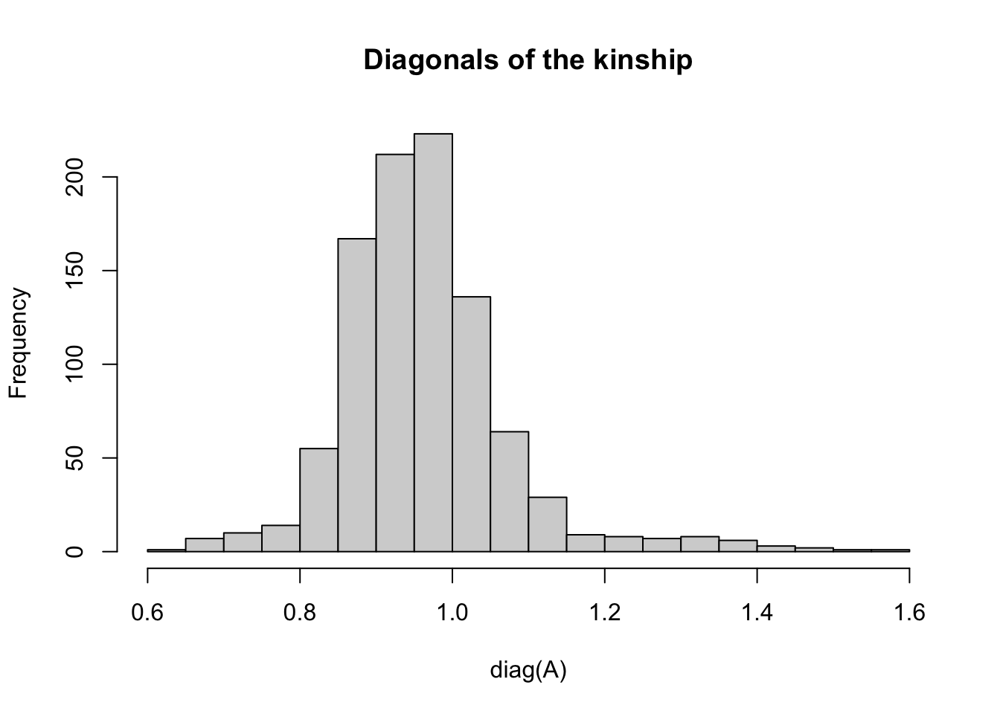
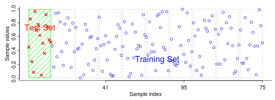

# Intro to Genomic Prediction


In previous sections, we processed and [prepared genotype data](prepare-genotypic-data) for downstream analyses. We also gathered and [prepared phenotypic data](prepare-phenotype-data), ultimately summarizing the plot-basis data into [BLUP values for each individual](preliminary-field-trial-analysis) in out training population.

We have the data ready to do genomic predictions.

Our process map indicates that the next step is to use cross-validation to check prediction accuracy, before completing prediction of **genomic estimated breeding values (GEBV)** for selections.

Before proceeding with the applied pipeline, work through this section and an introduction to **genomic prediction in R**.

If you have not had any training in quantitative genetics, mixed-models or genomic prediction, consider jumping to the bottom section of this chapter [recommended literature] for learning resources.

## `library(genomicMateSelectR)`

To facilitate the genomic selection pipeline, I built an R package, `genomicMateSelectR`, which can do the cross-validation, predictions and more using only a few functions. We already encountered a few of the functions in the package previously, when we [filtered variants](filter-variants), [constructed kinship matrices](construct-grms) and also a [recombination frequency matrix](recomb-freq-mat).

In those previous steps, we focused on simply applying the functions and creating the inputs that the process map indicates we will need. We didn't spend much time previously discussing what these inputs were or why we wanted them.

The functions from `genomicMateSelectR`, are themselves using functions from `library(sommer)`. Rather than simply applying the functions as instructed, we'll dig under-the-hood to understand what is happening.

It is *also* recommended that you check-out and work through the [vignettes for `genomicMateSelectR`](https://wolfemd.github.io/genomicMateSelectR/articles/non_additive_models.html), which should also help.

At the bottom of this chapter, I'll provide links and references for learning more. I *highly* recommend reading and learning from multiple sources, as no single author explains everything perfectly for everyone.

## Genomic BLUP

In the [previous section](preliminary-field-trial-analysis), we learned to use the `mmer()` function in `library(sommer)` to fit mixed-models *without* including genomic information.

We modeled the **germplasmName** variable, which distinguishes unique genotypes (i.e. cassava clones) as a random-effect and extracted the predicted **BLUP** for each clone as a measure of performance. In that model, each unique **germpasmName** was modeled by default as *independent and identically distributed* (*i.i.d.*). In other words, lacking additional information to input into the model, we assumed that each clone is unrelated to each other clone. In such a situation, we can only obtain performance predictions for clones that had phenotypes.

Here is a simple, mixed-model notation, ignoring fixed-effects for simplicity:

$$\boldsymbol{y} =\mu + \boldsymbol{g} +\boldsymbol{\epsilon}$$ The first equation says the phenotype $y$ is predicted by a overall population mean $\mu$ + the genetic values of each individual **germplasmName** ($g$, basically the genotype or clone mean) plus some unexplained residual values ($\epsilon$).

$$g \sim N(0,I\sigma^2_{g})$$

This second notation says that the term $g$ is modeled as a random effect, drawn from a normal distribution (indicated by the N) that has a mean of zero, and a variance parameter $\sigma^2_{g}$ and a covariance $\boldsymbol{I}$. Since $\boldsymbol{I}$ stands for the identity matrix, which has zeros off-diagonal, and 1's on the diagonal, all clones are to be modeled as being unrelated; in other words, *independent and identically distributed* (*i.i.d.*).

We know that this assumption is incorrect. All of the individuals in our population are expected to be related at some level.

To make this a genomic prediction model, we will primarily use a mixed-model approach known as "genomic BLUP" or **GBLUP** for short.

In the **GBLUP** model, instead of using an identity matrix $I$ to say that all clones are unrelated, we will directly measure the degree of relatedness of our individuals using SNP markers distributed genome-wide. We will create what is called a "genomic relatedness matrix" (GRM), also called often called a kinship matrix and often notated as $\boldsymbol{K}$.

So to make our mixed-model used in the previous section to get BLUPs into a genomic prediction model, we "simply" replace the $\boldsymbol{I}$ with$\boldsymbol{K}$ in the mixed-model equations:

$$g \sim N(0,K\sigma^2_{g})$$ *We are assuming the relative similarity or dissimilarity between the performance of our clones is proportional to their degree of relatedness.*

We model the **germplasmName** variable with a covariance, the GRM in our mixed-model and obtain BLUPs, which we can call GBLUPs, that are conditioned on the resemblance between relatives. As long as the GRM is constructed using a particular formula, we will be predicted breeding values, and thus the term you've all heard: *genomic estimated breeding values* (**GEBVs**).

*The mixed-model equations can accommodate prediction of individuals that have genotypes and are in the kinship matrix, even if they do not have phenotypes.* In other words, we can predict the performance of individuals on the basis of their (ideally close) relatives.

### Getting started

Start with BLUPs from the [previous step](preliminary-field-trial-analysis).


```r
blups<-readRDS(here::here("output","blups.rds"))
```

### Kinship matrix

In the chapter on [preparing genotypic data](prepare-genotypic-data), we used database-sourced genotype data and the `genomicMateSelectR` function `kinship()` to create an additive genomic relationship matrix.


```r
A<-readRDS(file=here::here("output","kinship_add.rds"))
```

Let's take a look at the contents of the matrix:


```r
A[1:5,1:5]
#>                    IITA-TMS-IBA30572 IITA-TMS-IBA940237
#> IITA-TMS-IBA30572         0.86194941        -0.09134081
#> IITA-TMS-IBA940237       -0.09134081         0.95954799
#> IITA-TMS-IBA961642       -0.20180585         0.04458302
#> IITA-TMS-ONN920168        0.15812456        -0.09358516
#> IITA-TMS-WAR4080          0.82642409        -0.09229778
#>                    IITA-TMS-IBA961642 IITA-TMS-ONN920168
#> IITA-TMS-IBA30572         -0.20180585         0.15812456
#> IITA-TMS-IBA940237         0.04458302        -0.09358516
#> IITA-TMS-IBA961642         1.00259446        -0.16869620
#> IITA-TMS-ONN920168        -0.16869620         0.95173805
#> IITA-TMS-WAR4080          -0.19569202         0.15481065
#>                    IITA-TMS-WAR4080
#> IITA-TMS-IBA30572        0.82642409
#> IITA-TMS-IBA940237      -0.09229778
#> IITA-TMS-IBA961642      -0.19569202
#> IITA-TMS-ONN920168       0.15481065
#> IITA-TMS-WAR4080         0.85217903
```


```r
dim(A)
#> [1] 963 963
```

Notice that it is square (same number rows and columns) and symmetrix around the diagonal values.


```r
hist(A[lower.tri(A)], main='Off-diagonal values (lower-triangle) of the kinship matrix')
```


The off-diagonals express the genomic relatedness between different individuals in the dataset.

This formulation has a mean-value of zero, such that \>0 kinship means "more than the average population level of relatedness" while \<0 values mean "greater than average".


```r
hist(diag(A), main='Diagonals of the kinship', breaks=20)
```



The diagonal values express the relatedness of each individual to itself, which should be interpreted as the level of inbreeding (homozygosity).

The matrix is constructed using the same formula implemented in the "classic" `rrBLUP` function `A.mat()`: From @vanraden2008, Method 1.

I find the paper by Vitezica et al. 2013 particularly helpful in understanding additive (and non-additive) genomic relationships: @Vitezica2013.

**To understand more:**

-   <http://nce.ads.uga.edu/wiki/lib/exe/fetch.php?media=uga_3_relationship.pdf>
-   <https://colloque.inrae.fr/iufro2016/content/download/5576/73493/version/1/file/Legarra_IUFROArcachon_2016.pdf>
-   <https://plant-breeding-genomics.extension.org/genomic-relationships-and-gblup/>

### Genomic prediction


```r
# pull out one trait (DM) BLUPs
dm_blups<-blups$blups[[1]]
dm_blups %>% head
#> # A tibble: 6 × 6
#>   germplasmName        BLUP   PEV   REL drgBLUP    WT
#>   <chr>               <dbl> <dbl> <dbl>   <dbl> <dbl>
#> 1 IITA-TMS-IBA000070 -0.776 0.172 0.963  -0.806  5.27
#> 2 IITA-TMS-IBA070593 -4.38  0.389 0.917  -4.78   3.82
#> 3 IITA-TMS-IBA30572  -0.690 0.162 0.965  -0.715  5.37
#> 4 IITA-TMS-IBA980581 -1.17  0.173 0.963  -1.21   5.26
#> 5 IITA-TMS-IBA982101 -1.94  0.467 0.900  -2.15   3.45
#> 6 TMEB419             1.59  0.240 0.949   1.68   4.73
```
Now we have all we need to implement a GBLUP model using `mmer()`.

One thing to note:


```r
table(dm_blups$germplasmName %in% rownames(A))
#> 
#> FALSE  TRUE 
#>   463   346
```

If you go back to the chapter on [preparing genotypic data](prepare-genotypic-data) you will recall that in this dataset, there are phenotyped-but-not-genotyped lines.


```r
table(rownames(A) %in% dm_blups$germplasmName)
#> 
#> FALSE  TRUE 
#>   617   346
```

There are also genotyped-but-not-phenotyped lines.

It is always important to check this and to verify that the result you are getting makes sense. Are there accessions that are not appearing genotyped (or phenotyped), which you were expecting? If so, you need to trace it. There may be names that didn't match, which could require fixing *preferably in the database to ensure long-term improvement in the ease and correctness of your analyses*.

Phenotyped-but-not-genotyped lines need to be excluded from the analysis. Genotyped-but-not-phenotyped lines, as discussed above are accepted and can be predicted.


```r
dm_blups %<>% 
     filter(germplasmName %in% rownames(A))
```

This time, the de-regressed BLUPs (**drgBLUP**) from the previous step are the response data. We will use the weights (**WT**) computed previously in the `weights=` argument of `mmer()`.


```r
gblup_all<-mmer(fixed = drgBLUP~1,
                # here we specify a random-effect for the "germplasmName" variable
                # and supply the kinship matrix "A" as follows:
                random = ~vs(germplasmName,Gu=A),
                weights = WT,
                data=dm_blups)
#> Adding additional levels of Gu in the model matrix of 'germplasmName' 
#> iteration    LogLik     wall    cpu(sec)   restrained
#>     1      -187.325   12:44:22      0           0
#>     2      -187.167   12:44:22      0           0
#>     3      -187.095   12:44:22      0           0
#>     4      -187.077   12:44:22      0           0
#>     5      -187.075   12:44:22      0           0
#>     6      -187.075   12:44:22      0           0
```

Here's how to get out the **GEBV** from the `mmer()` output:


```r
gebv<-gblup_all$U$`u:germplasmName`$drgBLUP
# Notice the "germplasmName" and "drgBLUP" references in this call 
## are specific to the analysis/dataset in question. 
## See the sommer manual on CRAN. 
```

Things to notice:


```r
length(gebv)
#> [1] 963
```

Only 346 phenotyped lines were included. 963 genotyped lines in the kinship matrix. 963 GEBV predicted!


```r
summary(gebv)
#>    Min. 1st Qu.  Median    Mean 3rd Qu.    Max. 
#> -2.9475 -0.3902  0.0270  0.0000  0.4331  1.6265
```

GEBV are centered on zero.

### Prediction accuracy

Now we can move into a more potentially complicated arena: evaluating prediction accuracy.

There are many scenarios and styles for doing this.

Let's start *super* simple.

Of the 346 phenotyped lines, I randomly sample approx. 1/5 (20%) or 70 lines.


```r
set.seed(1212)
test_set<-sample(dm_blups$germplasmName,size = ceiling(346/5), replace = F)
```

Remove the lines chosen (**test_set**) from the training dataset:


```r
training_blups<-dm_blups %>% 
     filter(!germplasmName %in% test_set)
```

Fit the prediction model:


```r
gblup_train<-mmer(fixed = drgBLUP~1,
                  # here we specify a random-effect for the "germplasmName" variable
                  # and supply the kinship matrix "A" as follows:
                  random = ~vs(germplasmName,Gu=A),
                  weights = WT,
                  data=training_blups)
#> Adding additional levels of Gu in the model matrix of 'germplasmName' 
#> iteration    LogLik     wall    cpu(sec)   restrained
#>     1      -151.68   12:44:23      0           0
#>     2      -151.327   12:44:23      0           0
#>     3      -151.132   12:44:23      0           0
#>     4      -151.062   12:44:24      1           0
#>     5      -151.049   12:44:24      1           0
#>     6      -151.046   12:44:24      1           0
#>     7      -151.046   12:44:24      1           0
```

Again, all 963 lines in the kinship matrix get GEBV output.

Now we can compare (correlate) the GEBV predicted for the held-out **test_set** lines to the BLUPs for those lines.

This is considered an estimate of **"prediction accuracy"**.


```r
# grab the gebv only for the test_set lines
gebv_test<-gblup_train$U$`u:germplasmName`$drgBLUP[test_set]
# merge the original BLUPs (for the test set only) to the corresponding GEBV
# I use a left_join() or merge() to be absolutely sure there are no mix-ups
gebv_vs_blups_testset<-dm_blups %>% 
     filter(germplasmName %in% test_set) %>% 
     left_join(tibble(germplasmName=names(gebv_test),GEBV=as.numeric(gebv_test)))
#> Joining, by = "germplasmName"
```

Correlate the GEBV with the BLUP for the test_set.


```r
gebv_vs_blups_testset %$% cor(BLUP,GEBV)
#> [1] 0.09310568
```

This correlation represents an estimate of accuracy predicting lines that aren't phenotyped, based only on their genetic relatedness and the phenotypes of their relatives.

Sure, this is a low values. But it's a small dataset using a small sample of markers to make compute fast for example purposes.

## Cross-validation

At it's simplest, cross-validation involves assessing the expected accuracy of predicting untested lines by doing the above procedure multiple times across multiple random samples.

Here's a nice graphic to illustrate:



[Click here](https://imada.sdu.dk/~marco/Teaching/AY2010-2011/DM825/) for the original, animated version.

Do a quick google search for "k-fold cross validation" and you find plenty of good graphical explanations.

Cross-validation functions get complicated quickly as they have loops within loops. I built a function `runCrossVal()` that fits several different models, handles multiple traits, can run in-parallel across mutiple compute-cores and even accepts selection index weights to compute selection index accuracy. `runCrossVal()` is included in the `genomicMateSelectR` package.

Below, I use it on only 1 trait, additive-only model.

**NOTES:** - doesn't work properly *unless* `gid="GID"`. - It also requires you to remove any phenotyped lines that aren't genotyped.

Following chunk does both of those:


```r
blups_forRunCrossValFunc<-blups %>% 
     # just one trait
     slice(1) %>% 
     # need to rename the "blups" list to comply with the runCrossVal function
     rename(TrainingData=blups) %>% 
     dplyr::select(Trait,TrainingData) %>% 
     # need also to remove phenotyped-but-not-genotyped lines
     # couldn't hurt to also subset the kinship to only phenotyped lines... would save RAM
     mutate(TrainingData=map(TrainingData,
                             ~filter(.,germplasmName %in% rownames(A)) %>% 
                                  # rename the germplasmName column to GID
                                  rename(GID=germplasmName)))
```


```r
standardCV<-runCrossVal(blups=blups_forRunCrossValFunc,
                        modelType="A",
                        selInd=FALSE,
                        grms=list(A=A),
                        nrepeats=2,nfolds=5,
                        gid="GID",seed=424242,
                        ncores=5)
#> Loading required package: rsample
#> Loading required package: furrr
#> Loading required package: future
#> iteration    LogLik     wall    cpu(sec)   restrained
#>     1      -144.984   12:44:27      0           0
#>     2      -144.923   12:44:27      0           0
#>     3      -144.908   12:44:27      0           0
#>     4      -144.907   12:44:27      0           0
#>     5      -144.907   12:44:27      0           0
#> [1] "GBLUP model complete - one trait"
#> [1] "Genomic predictions done for all traits in one repeat-fold"
#> iteration    LogLik     wall    cpu(sec)   restrained
#>     1      -153.227   12:44:28      0           0
#>     2      -152.232   12:44:28      0           0
#>     3      -151.805   12:44:28      0           0
#>     4      -151.687   12:44:28      0           0
#>     5      -151.669   12:44:28      0           0
#>     6      -151.666   12:44:28      0           0
#>     7      -151.666   12:44:28      0           0
#> [1] "GBLUP model complete - one trait"
#> [1] "Genomic predictions done for all traits in one repeat-fold"
#> Joining, by = "GID"
#> Joining, by = "GID"
#> iteration    LogLik     wall    cpu(sec)   restrained
#>     1      -151.026   12:44:28      1           0
#>     2      -150.948   12:44:28      1           0
#>     3      -150.911   12:44:28      1           0
#>     4      -150.901   12:44:28      1           0
#>     5      -150.899   12:44:28      1           0
#>     6      -150.899   12:44:28      1           0
#> [1] "GBLUP model complete - one trait"
#> [1] "Genomic predictions done for all traits in one repeat-fold"
#> iteration    LogLik     wall    cpu(sec)   restrained
#>     1      -149.818   12:44:29      1           0
#>     2      -149.812   12:44:29      1           0
#>     3      -149.809   12:44:29      1           0
#>     4      -149.808   12:44:29      1           0
#> [1] "GBLUP model complete - one trait"
#> [1] "Genomic predictions done for all traits in one repeat-fold"
#> Joining, by = "GID"
#> Joining, by = "GID"
#> iteration    LogLik     wall    cpu(sec)   restrained
#>     1      -151.038   12:44:28      0           0
#>     2      -150.851   12:44:28      0           0
#>     3      -150.757   12:44:28      0           0
#>     4      -150.728   12:44:28      0           0
#>     5      -150.723   12:44:28      0           0
#>     6      -150.722   12:44:28      0           0
#> [1] "GBLUP model complete - one trait"
#> [1] "Genomic predictions done for all traits in one repeat-fold"
#> iteration    LogLik     wall    cpu(sec)   restrained
#>     1      -151.393   12:44:29      0           0
#>     2      -151.304   12:44:29      0           0
#>     3      -151.258   12:44:29      0           0
#>     4      -151.245   12:44:29      0           0
#>     5      -151.243   12:44:29      0           0
#>     6      -151.243   12:44:30      1           0
#> [1] "GBLUP model complete - one trait"
#> [1] "Genomic predictions done for all traits in one repeat-fold"
#> Joining, by = "GID"
#> Joining, by = "GID"
#> iteration    LogLik     wall    cpu(sec)   restrained
#>     1      -151.902   12:44:29      0           0
#>     2      -151.609   12:44:29      0           0
#>     3      -151.464   12:44:29      0           0
#>     4      -151.417   12:44:29      0           0
#>     5      -151.409   12:44:29      0           0
#>     6      -151.407   12:44:29      0           0
#>     7      -151.407   12:44:29      0           0
#> [1] "GBLUP model complete - one trait"
#> [1] "Genomic predictions done for all traits in one repeat-fold"
#> iteration    LogLik     wall    cpu(sec)   restrained
#>     1      -149.63   12:44:30      0           0
#>     2      -149.534   12:44:30      0           0
#>     3      -149.48   12:44:30      0           0
#>     4      -149.46   12:44:30      0           0
#>     5      -149.457   12:44:30      0           0
#>     6      -149.456   12:44:30      0           0
#> [1] "GBLUP model complete - one trait"
#> [1] "Genomic predictions done for all traits in one repeat-fold"
#> Joining, by = "GID"
#> Joining, by = "GID"
#> iteration    LogLik     wall    cpu(sec)   restrained
#>     1      -150.381   12:44:29      0           0
#>     2      -150.129   12:44:29      0           0
#>     3      -150.014   12:44:29      0           0
#>     4      -149.984   12:44:29      0           0
#>     5      -149.98   12:44:30      1           0
#>     6      -149.98   12:44:30      1           0
#> [1] "GBLUP model complete - one trait"
#> [1] "Genomic predictions done for all traits in one repeat-fold"
#> iteration    LogLik     wall    cpu(sec)   restrained
#>     1      -144.924   12:44:30      0           0
#>     2      -144.405   12:44:30      0           0
#>     3      -144.256   12:44:30      0           0
#>     4      -144.235   12:44:30      0           0
#>     5      -144.234   12:44:31      1           0
#> [1] "GBLUP model complete - one trait"
#> [1] "Genomic predictions done for all traits in one repeat-fold"
#> Joining, by = "GID"
#> Joining, by = "GID"
standardCV %>% unnest(accuracyEstOut) 
#> # A tibble: 10 × 9
#>    repeats  seeds splits     id    Trait predOf predVSobs   
#>      <int>  <int> <list>     <chr> <chr> <chr>  <list>      
#>  1       1 395601 <split [2… Fold1 DM    GEBV   <tibble [96…
#>  2       1 395601 <split [2… Fold2 DM    GEBV   <tibble [96…
#>  3       1 395601 <split [2… Fold3 DM    GEBV   <tibble [96…
#>  4       1 395601 <split [2… Fold4 DM    GEBV   <tibble [96…
#>  5       1 395601 <split [2… Fold5 DM    GEBV   <tibble [96…
#>  6       2 215870 <split [2… Fold1 DM    GEBV   <tibble [96…
#>  7       2 215870 <split [2… Fold2 DM    GEBV   <tibble [96…
#>  8       2 215870 <split [2… Fold3 DM    GEBV   <tibble [96…
#>  9       2 215870 <split [2… Fold4 DM    GEBV   <tibble [96…
#> 10       2 215870 <split [2… Fold5 DM    GEBV   <tibble [96…
#> # … with 2 more variables: Accuracy <dbl>,
#> #   NcompleteTestPairs <dbl>
```

**NOTE:** Ignore the `NcompleteTestPairs` variable. It's broken, but unimportant and I haven't have time yet to fix it. I checked carefully and the actual prediction accuracy is correct.


```r
# Run this code to prove it, if you are interested :)
# just checking the number of paired GEBV-BLUPs per test-set:
# standardCV %>% 
#      unnest(accuracyEstOut) %>% 
#      mutate(NcompleteTestPairs=map_dbl(predVSobs,~na.omit(.) %>% nrow(.)))
```

## rrBLUP and equivalency to GBLUP

### RR-BLUP aka SNP-BLUP

I want to briefly cover and demonstrate an alternative, and under the right circumstances, equivalent model for genomic prediction: ridge-regression BLUP, aka SNP-BLUP. The rrBLUP model is a genome-wide marker regression model. There are many styles of this, especially in the Bayesian arena.

In marker-regression models, SNPs are used directly as predictors in a regression model, instead of using them to create a relatedness matrix. Both RRBLUP and GBLUP use a mixed-model approach.

For GBLUP we had:

$$\boldsymbol{y} =\mu + \boldsymbol{g} +\boldsymbol{\epsilon}$$ The random-effect predictor is simply the clone identity (germplasmName) and the covariance between those identities is input as the kinship matrix.

For RR-BLUP, we have instead:

$$\boldsymbol{y} =\mu + \boldsymbol{Zu} +\boldsymbol{\epsilon}$$

$$u \sim N(0,I\sigma^2_{u})$$

$\boldsymbol{Z}$ is matrix of dimension **N-individuals** by **P-SNPs**. The vector $\boldsymbol{u}$ has dimension **P-SNP** by 1 and contains the BLUPs, which in this case represent SNP-effect predictions (SNP-BLUPs), with mean-effect 0, drawn *i.i.d.* from a normal distribution with variance $\sigma^2_{u}$. Note that the variance parameter here is the variance among SNP-effects, *not* the variance among the **GEBV** of clones.

**GEBV** are obtainable from this model by: $\boldsymbol{g} = \boldsymbol{Zu}$.

The equivalence of RRBLUP and GBLUP come when the matrix of predictors, $\boldsymbol{Z}$ is centered in the same way as in the genomic relationshp matrix.

[**Click here**](https://htmlpreview.github.io/?https://github.com/lfelipe-ferrao/lfelipe-ferrao.github.io/blob/master/class/quantGenetic/week12.html) and go to section 1.2.1 "VanRaden's first genomic relationship matrix" for an explanation of the formula used for the kinship matrix.

Below, I'll demonstrate:

```r
# load the dosage matrix
M<-readRDS(file=here::here("data","dosages.rds"))
# re-load and extract the blups for just 1 trait
blups<-readRDS(file=here::here("output","blups.rds"))
dm_blups<-blups$blups[[1]]
# remove phenotyped-but-not-genoypted blups
dm_blups %<>% 
     filter(germplasmName %in% rownames(M))
# remove genotyped-but-not-phenoypted (not strictly necessary)
M<-M[rownames(M) %in% dm_blups$germplasmName,]
# Create a kinship matrix "K"
K<-kinship(M,"add")
# Now create a centered dosage matrix, to use as predictors for rr-BLUP
Z<-centerDosage(M)
```

Fit the GBLUP model

```r
gblup<-mmer(fixed = drgBLUP~1,
            random = ~vs(germplasmName,Gu = K),
            weights = WT,
            data=dm_blups)
#> iteration    LogLik     wall    cpu(sec)   restrained
#>     1      -187.324   12:44:32      0           0
#>     2      -187.166   12:44:32      0           0
#>     3      -187.095   12:44:32      0           0
#>     4      -187.077   12:44:32      0           0
#>     5      -187.075   12:44:32      0           0
#>     6      -187.075   12:44:32      0           0
```
Now fit the RRBLUP model

```r
# one catch
# the rows of the centered dosage matrix must be matched
## to the rows of data.frame with the blups
## one way to do this is by creating and incidence matrix
## use the model.matrix() function as follows:
ZincMat=model.matrix(~factor(germplasmName,levels=rownames(Z))-1,data=dm_blups) # -1 because we don't want an intercept here
dim(ZincMat) # [1] 346 346 
#> [1] 346 346
# relates the rows of the BLUPs to the rows the marker matrix

# now fit the RRBLUP model
rrblup<-mmer(fixed = drgBLUP~1,
             random = ~vs(list(ZincMat%*%Z),buildGu = FALSE),
             weights = WT,
             data=dm_blups)
#> iteration    LogLik     wall    cpu(sec)   restrained
#>     1      -269.814   12:44:35      2           0
#>     2      -195.427   12:44:35      2           0
#>     3      -190.328   12:44:35      2           0
#>     4      -187.801   12:44:35      2           0
#>     5      -187.201   12:44:35      2           0
#>     6      -187.093   12:44:35      2           0
#>     7      -187.077   12:44:35      2           0
#>     8      -187.075   12:44:36      3           0
#>     9      -187.075   12:44:36      3           0
```

```r
# extract the SNP-BLUPs
u<-as.matrix(rrblup$U$`u:Z`$drgBLUP)
all(rownames(u)==colnames(Z))
#> [1] TRUE
```

```r
summary(u)
#>        V1            
#>  Min.   :-0.0163276  
#>  1st Qu.:-0.0024412  
#>  Median :-0.0001831  
#>  Mean   :-0.0002119  
#>  3rd Qu.: 0.0020687  
#>  Max.   : 0.0151979
```

```r
hist(u,breaks=20,main = 'Distribution of SNP effects')
```


```r
# extract the G-BLUPs (GEBVs)
g<-gblup$U$`u:germplasmName`$drgBLUP
all(names(g) %in% rownames(Z))
#> [1] TRUE
```

```r
# calculate the GEBVs using the SNP-effects (SNP-BLUPs)
g_rr<-Z[names(g),]%*%u
all(rownames(g_rr)==names(g))
#> [1] TRUE
```

```r
g_rr[1:5,]
#> IITA-TMS-IBA000070 IITA-TMS-IBA070593  IITA-TMS-IBA30572 
#>         -0.1260352         -2.0363146         -0.7000067 
#> IITA-TMS-IBA980581 IITA-TMS-IBA982101 
#>         -0.9159732         -1.5152420
```

```r
g[1:5]
#> IITA-TMS-IBA000070 IITA-TMS-IBA070593  IITA-TMS-IBA30572 
#>         -0.1254919         -2.0334329         -0.6996188 
#> IITA-TMS-IBA980581 IITA-TMS-IBA982101 
#>         -0.9151958         -1.5134661
```

```r
# cor(g,g_rr) # [1,] 0.9999997
plot(x=g,y=g_rr, main = 'Proof that GEBV from GBLUP and RRBLUP are the equal!'); abline(a=0,b=1,col='red')
```


## Recommended Literature

Check out this open-source 3-section short-course:\
"[Survey of Breeding Tools and (Genomic Selection) Methods](https://lfelipe-ferrao.github.io/class/survey/)" by Particio Munoz and Felipe Ferrao at the U. of Florida. They do their best in a very short space to cover (1) introductory quantitative genetic models, (2) Statistical learning and whole-genome regression models, esp. rrBLUP and GBLUP models, and (3) theoretical and practical aspects of genomic selection.

I haven't looked at all the details, but they also offer an open-source plant breeding focused "[Quantitative Genetics](https://lfelipe-ferrao.github.io/class/quantGenetic/)" course!

Below is a list borrowed credit Felipe Ferrão's course:

### Quantitative Genetics

-   Bernardo, 2010. Breeding for Quantitative Traits in Plant Breeding. [Book link](http://stemmapress.com/)
-   Falconer and Mackay, 1996. Introduction to Quantitative Genetics. [Book link](https://www.amazon.com/Introduction-Quantitative-Genetics-Douglas-Falconer/dp/0582243025)
-   Lynch and Walsh, 1998. Genetics and Analysis of Quantitative Traits. [Book link](https://www.amazon.com/Genetics-Analysis-Quantitative-Traits-Michael/dp/0878934812)

### Genomic Selection

-   Wolfe 2016. Genomic Selection: Prediction Methodology & Practical Application. Lecture Slides (gSlides) presented to the "Regional Southeast Asian Cassava Breeder's Network Training" in November 2016. [gSlides Link](https://docs.google.com/presentation/d/1lFioutQq58IYs9-ewB7c24xfEHoy7TD5qAxNvJvYif8/edit?usp=sharing)
-   Mrode, 2014. Linear Models for the Prediction of Animal Breeding Values. [Book link](https://www.amazon.com/Linear-Models-Prediction-Animal-Breeding/dp/1845939816)
-   Isik et al., 2017. Genetic Data Analysis for Plant and Animal Breeding. [Book link](https://www.springer.com/gp/book/9783319551753)

### Additional (free) learning resources

**Learn more about genomic prediction**

-   [Slides by Bruce Walsh on BLUP and Genomic Selection](http://nitro.biosci.arizona.edu/workshops/Synbreed2013/Lectures/Lecture28.pdf)

-   [Mixed Models for Quantitative Genetics by Bruce Walsh](http://nitro.biosci.arizona.edu/workshops/MM2012/MM-2012.html)

-   [Lecture 5: BLUP (Best Linear Unbiased Predictors) of genetic values - by Bruce Walsh](https://zdoc.pub/lecture-5-blup-best-linear-unbiased-predictors-of-genetic-va.html)

-   [Excellence in Breeding - Basics of GS - 2021 YouTube Video Series with Eduardo Covarrubias](https://www.youtube.com/playlist?list=PLZ0lafzH_UmfHsoePj0t7xQglKSOpzbDp)
